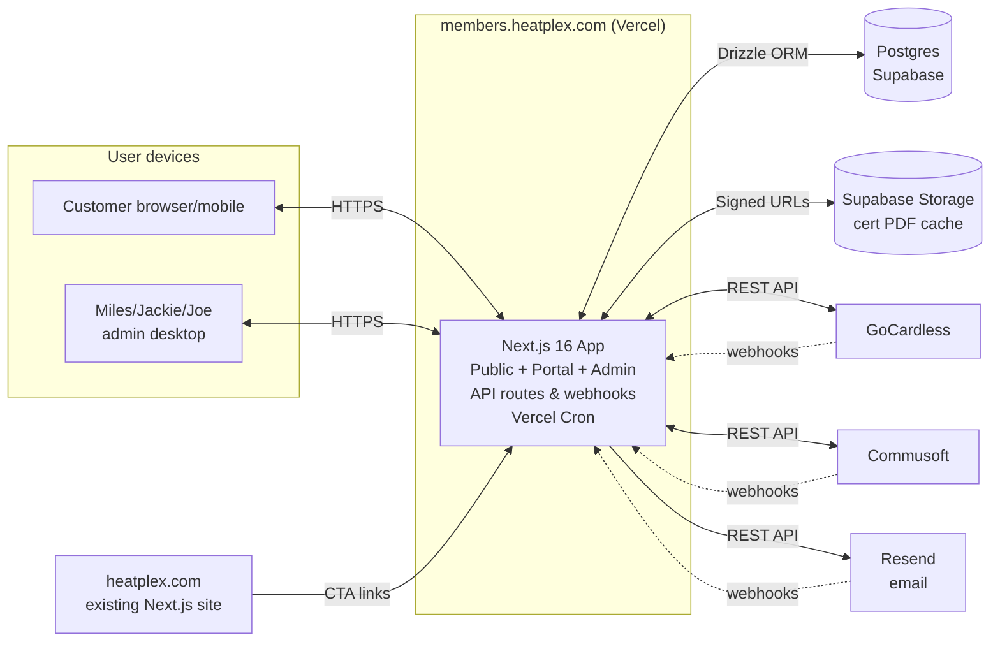

# Heat Plex Membership Platform — Functional Requirements Document

| | |
|---|---|
| **Document version** | 1.0 |
| **Date** | 2026-05-19 |
| **Status** | Final for v1 implementation |
| **Owner** | Heat Plex Ltd |
| **Audience** | Developer building the platform |
| **Related documents** | `01-marketing-landing-prompt.md` (separate task — marketing page on heatplex.com) |

---

## Table of contents

1. [Executive summary](#1-executive-summary)
2. [Glossary](#2-glossary)
3. [Stakeholders & users](#3-stakeholders--users)
4. [Goals & non-goals](#4-goals--non-goals)
5. [System architecture](#5-system-architecture)
6. [Technology stack](#6-technology-stack)
7. [Functional requirements](#7-functional-requirements)
8. [Non-functional requirements](#8-non-functional-requirements)
9. [Data model](#9-data-model)
10. [API surface](#10-api-surface)
11. [UI/UX system](#11-uiux-system)
12. [Operations](#12-operations)
13. [Security](#13-security)
14. [Compliance](#14-compliance)
15. [Testing](#15-testing)
16. [Deployment & infrastructure](#16-deployment--infrastructure)
17. [Phasing](#17-phasing)
18. [Out of scope](#18-out-of-scope)
19. [Acceptance criteria](#19-acceptance-criteria)
20. [Appendices](#20-appendices)

---

## 1. Executive summary

### 1.1 What we're building

A single-tenant member subscription platform for **Heat Plex Ltd**, a heating and plumbing company based in Battersea, South London, servicing high-end residential customers within a 5-mile radius. The platform lets customers pay £199/year or £19.99/month for "Heat Plex Membership", which entitles them to:

- 20% off every job
- A free annual boiler service
- A free Gas Safety Certificate (CP12)
- Priority access to spring service slots
- A member portal at `members.heatplex.com`

The platform handles signup, payment, identity reconciliation with Heat Plex's existing field service software (**Commusoft**), member self-service (booking annual services, downloading certificates, viewing job history, updating payment details, cancelling), automated lifecycle emails, and an internal admin surface for the Heat Plex team.

### 1.2 Business context

Heat Plex has set the following member acquisition targets:

| Milestone | Target members |
|---|---|
| 30 days | 100–150 |
| 60 days | 150–300 |
| 90 days | 300+ |
| 6 months | 500 |

These targets come from the **Heat Plex Membership Growth Execution System** ("the Playbook" — a separate internal document the developer should request from Heat Plex if not already supplied), which prescribes how members are acquired across channels: engineer on-site conversions, automated post-job email sequences, existing customer database outreach, paid ads, and referrals. This platform's role is to make every signup channel frictionless and to make the post-signup experience justify the £199 price point.

### 1.3 Scope at a glance

**In scope (v1):**
- Public marketing page (`heatplex.com/membership` — built separately via `01-marketing-landing-prompt.md`)
- Sign-in landing at `members.heatplex.com/`
- 4-step signup wizard
- Member portal (8 features: overview, savings, service booking with AM/PM slots, certificates, jobs, billing, settings, cancellation)
- GoCardless payment integration (Instant Bank Pay for annual, Bacs DD for monthly)
- Real-time Commusoft sync (REST API + webhooks)
- Transactional + lifecycle emails via Resend
- Admin surface for Miles/Jackie/Joe (KPI dashboard, member management, engineer leaderboard, commission tracking, alerts inbox, audit log)
- UK GDPR / PECR / DMCC Act compliance

**Out of scope (v1):**
- SMS communications (deferred to v1.1)
- Multi-property / landlord plans (v1.1)
- Refer-a-friend (v1.1)
- Engineer-facing mobile tooling (engineers continue using Commusoft on their phones)
- Multi-tenant / SaaS infrastructure (Heat Plex only)
- Live engineer ETA tracking on day of service (Commusoft's existing capability)
- Customer chat / in-app messaging (phone + WhatsApp continue)

### 1.4 The target outcome

By the end of v1 delivery, a Battersea customer can:

1. Click "Join now" on `heatplex.com/membership`, land on `members.heatplex.com/join/plan`, complete the 4-step wizard, pay £199 via Instant Bank Pay, and receive a welcome email — all in under 3 minutes.
2. Log into `members.heatplex.com/` via a one-tap magic link, see their membership status, savings to date, and a clear "Book your annual service" CTA.
3. Book their boiler service for a Tuesday morning, see the booking confirmed instantly, and have a corresponding job appear in Heat Plex's Commusoft scheduler.
4. Download their CP12 certificate as a PDF the moment the engineer issues it.
5. Cancel their membership self-serve from the portal without phoning the office.

And the Heat Plex team can:

1. Open `members.heatplex.com/admin` on Monday morning, see the week's KPIs (new members, conversion rate, revenue, leaderboard) at a glance, and export a single-page PDF report to email to Joe.
2. Search any member, view their full history, issue refunds, switch their plan, or backdate a signup to a recent job — all without leaving the admin surface.
3. Receive alerts when payments fail, members need attention, or Commusoft sync drifts — and resolve them inline.

---

## 2. Glossary

| Term | Definition |
|---|---|
| **Member** | A customer who has paid for and holds an active Heat Plex Membership |
| **Plan** | One of `annual` (£199/year) or `monthly` (£19.99/month, 12-month minimum) |
| **CP12** | "Gas Safety Certificate" — the document issued after the annual boiler service confirming safe gas installation. Legally required for landlords |
| **Commusoft** | Heat Plex's existing field service management software. The source of truth for customers, jobs, invoices, certificates, and engineer scheduling. Web app + mobile app for engineers |
| **GoCardless** | UK-based payment platform specialising in Direct Debit. Handles all payments in this system |
| **Bacs DD** | UK's national Direct Debit scheme. Funds settle T+3 working days from charge creation |
| **Instant Bank Pay (IBP)** | GoCardless's open-banking instant payment product. Funds settle same-day. Used for the £199 annual signup payment |
| **Mandate** | GoCardless object representing a customer's authorisation for Heat Plex to debit their bank account via Direct Debit |
| **Subscription** | GoCardless object representing a recurring schedule of charges against a mandate. Used for monthly £19.99 plans |
| **Webhook** | An HTTP POST from a third party (GoCardless, Commusoft, Resend) to our system, notifying us of an event |
| **Magic link** | Email-based passwordless authentication. Member enters email; we send a one-time link; clicking logs them in |
| **Sequence** | An automated series of email steps triggered by an event (e.g. job completion, signup, payment failure). Sometimes called a "drip campaign" |
| **PECR** | Privacy and Electronic Communications Regulations — UK rules governing marketing emails/SMS |
| **DMCC Act** | Digital Markets, Competition and Consumers Act 2024 — UK law governing subscription contracts |
| **Playbook** | The internal Heat Plex Membership Growth Execution System document |
| **Miles** | Heat Plex's operations manager. Primary admin user of this platform |
| **Jackie** | Heat Plex's office manager. Handles phone signups, payment processing, customer support |
| **Joe** | Heat Plex's owner. Receives weekly reports |
| **The team** (engineers) | Vas, Marinel, Spencer, Ryan, Albert — the field engineers who deliver services and convert members on-site |

---

## 3. Stakeholders & users

### 3.1 Heat Plex internal users

| User | Role | Primary platform actions |
|---|---|---|
| **Joe Mason** (owner) | Receives weekly reports; reviews escalations | Reads `/admin` dashboard; receives weekly PDF report; reviews critical alerts |
| **Miles** (operations manager) | Operates the platform day-to-day | Full admin: monitors KPIs, manages members, runs commission payouts, resolves alerts, monitors sync drift |
| **Jackie** (office manager) | Inbound customer service, phone signups, payment support | Admin: backdates signups, processes refunds, looks up member status, handles cancellations |
| **Engineers** | Field-based service delivery | **Not direct users of this platform.** They continue using Commusoft on their phones. They influence the system indirectly: marking "Membership offered Y/N" on Commusoft job-completion forms, getting attributed commissions via promo codes |

### 3.2 External users

| User | Description |
|---|---|
| **Prospective members** | High-end Battersea/Chelsea/Clapham/Wandsworth/Fulham homeowners. Age 35–65, household income £100k+. Mostly own period properties. Tech-comfortable but not tech-enthusiasts. Value reliability and clarity over price |
| **Active members** | Same demographic, now paying customers. Log in occasionally (every 2–3 months) to book service, check savings, or download certificate. Expect low-effort interactions |
| **Cancelled members** | Lapsed members who may return — preserve their data and offer easy reactivation |

### 3.3 User journey overview

```
PROSPECT
  → discovers Heat Plex Membership via:
     - engineer on-site conversation
     - 24h post-job email
     - heatplex.com/membership marketing page
     - Google Ads → marketing page
     - referral / word of mouth
  → clicks "Join now"
  → arrives at members.heatplex.com/join/plan
  → completes 4-step wizard (~3 minutes)
  → becomes ACTIVE MEMBER

ACTIVE MEMBER
  → receives welcome email + magic link
  → logs in, sees portal
  → books annual service (AM/PM slot, 3+ days out, within 12 weeks)
  → receives booking confirmation
  → service performed by Heat Plex engineer
  → CP12 issued automatically, appears in portal
  → savings counter updates with each future invoiced job

RENEWAL
  → 60d / 30d / 7d / 1d email reminders
  → on renewal date: auto-charge via stored mandate
  → on success: renewal_date extended +1 year
  → on failure: dunning sequence

CANCELLATION (initiated by member)
  → self-serve in portal
  → retention offer presented
  → cancellation confirmed
  → membership active until end of paid period
  → at end_date: status → cancelled, mandate cancelled, Commusoft tag removed
```

---

## 4. Goals & non-goals

### 4.1 Goals

| ID | Goal |
|---|---|
| G1 | Allow any prospect to sign up and pay (£199 or £19.99/mo) in ≤ 3 minutes via web |
| G2 | Settle £199 annual payments same-day via Instant Bank Pay (no T+3 wait) |
| G3 | Capture a reusable Direct Debit mandate at signup for renewal automation |
| G4 | Sync every member's status in real-time to Commusoft so engineers/office see member tag |
| G5 | Surface every member's job history, savings, and CP12 in the portal, pulled live from Commusoft |
| G6 | Let members book their annual service AM/PM slot self-serve, creating a Commusoft job |
| G7 | Run the playbook's automated post-job email sequence (24h / 3d / 7d) to convert non-members |
| G8 | Run renewal sequences (-60/-30/-7/-1) and auto-charge on renewal day |
| G9 | Handle payment failures with a 4-step dunning ladder (day 0 / +5d / +14d / +30d) |
| G10 | Give Miles a live KPI dashboard mirroring the playbook's weekly report |
| G11 | Track engineer commissions (£25 per attributed signup) via URL params + promo codes |
| G12 | Comply with UK GDPR, PECR, and the DMCC Act for subscriptions |

### 4.2 Non-goals

| ID | Non-goal |
|---|---|
| NG1 | We do not replace Commusoft. It remains the operational system of record |
| NG2 | We do not build engineer-facing mobile tooling. Engineers use Commusoft |
| NG3 | We do not auto-apply the 20% discount onto Commusoft quotes/invoices. Jackie applies manually; we tag the member and read the result |
| NG4 | We do not handle SMS in v1 (deferred to v1.1) |
| NG5 | We do not support multi-property/landlord plans in v1 (deferred to v1.1) |
| NG6 | We do not implement refer-a-friend in v1 (deferred to v1.1) |
| NG7 | We do not architect for multi-tenancy. Heat Plex only |
| NG8 | We do not build a CMS for email templates. Templates are code-defined |
| NG9 | We do not build live chat. Phone (020 7622 0444) and WhatsApp remain the support channels |
| NG10 | We do not store card or bank details. GoCardless owns that data |

---

## 5. System architecture

### 5.1 Top-level diagram



### 5.2 Three classes of work

1. **Synchronous user flows** — signup, booking, cancellation, payment update. Handled inline by Next.js Server Actions + API routes.
2. **Webhook-driven sync** — GoCardless payment events, Commusoft customer/job/invoice/certificate events, Resend bounce/complaint events. Idempotent, signature-verified, replay-safe.
3. **Scheduled background jobs** — Vercel Cron runs:
   - Every 5 min: drain sequence queue, drain Commusoft outbox
   - Every 15 min: refresh availability cache
   - Every 1 hour: detect outage / drift
   - Nightly 03:00 UK: reconciliation against Commusoft
   - Daily 09:00 UK: renewal checker, dunning ladder transitions

### 5.3 Direction of truth

| Data | Source of truth | Reason |
|---|---|---|
| Customer name, phone, email, address | Commusoft | Already lives there; Jackie/engineers edit daily |
| Job records, invoices, certificates | Commusoft | Operational + statutory |
| Membership status, plan, dates | Our DB | We own subscription lifecycle |
| Payment of record (mandates, charges) | GoCardless | They process it; we mirror |
| Service bookings | Our DB → pushed to Commusoft | We orchestrate; Commusoft is the schedule |
| Engineer commissions | Our DB | Derived from Commusoft data |

If two systems disagree, the source of truth above wins. Conflicting writes from non-owner systems are ignored.

---

## 6. Technology stack

| Layer | Tool | Version | Rationale |
|---|---|---|---|
| Framework | Next.js | 16.x | App Router, Server Actions, Vercel Cron — matches existing heatplex.com codebase |
| UI library | React | 19.x | Required by Next 16 |
| Language | TypeScript | 5.8+ | Strict mode required |
| Styling | Tailwind CSS | 4.x | Matches existing heatplex.com |
| Animation | Framer Motion | 12.x | Subtle, brand-tasteful transitions |
| Icons | Lucide React | 0.5+ | Already in heatplex.com |
| ORM | Drizzle | latest | Type-safe SQL builder; better DX than Prisma at this scale; lighter runtime |
| Database | Postgres | 15+ (Supabase) | Standard, robust, integrated auth helpers, file storage, PITR |
| Email validation | Loqate (getAddress.io UK) | — | Postcode autocomplete on signup |
| Payments | GoCardless | API v2 (2015-07-06+) | Locked in; UK Bacs DD + Instant Bank Pay |
| Field service | Commusoft | REST API (latest) | Existing Heat Plex tool |
| Transactional email | Resend | latest | Modern API, good deliverability, simple DKIM/SPF |
| Email composition | React Email | latest | Branded HTML email components |
| Error monitoring | Sentry | latest | Industry-standard; free tier sufficient at this scale |
| Logging | Logtail or Axiom | latest | Structured JSON logs, searchable |
| Hosting | Vercel | — | Same platform as heatplex.com; Next.js-native; Cron included |
| Domain | Cloudflare DNS | — | Heat Plex's existing DNS (assume — verify with Heat Plex IT) |
| File cache | Supabase Storage | — | Gas certificate PDFs cached here for fast member downloads |
| Testing | Vitest | latest | Unit + integration |
| E2E testing | Playwright | latest | Cross-browser, reliable |
| Validation | Zod | latest | Server-side input validation everywhere |
| Session signing | Node `crypto.subtle` | built-in | HMAC for session cookies |
| Rate limiting | Upstash Redis (Vercel) | — | Sliding-window rate limits |
| Date handling | date-fns | latest | Smaller than moment, tree-shakable |

### Explicit not-used list

- ❌ Stripe (chose GoCardless)
- ❌ Twilio (no SMS in v1)
- ❌ Mailchimp / Klaviyo / Customer.io (lifecycle automation in-house)
- ❌ Auth0 / Clerk / NextAuth (custom magic-link auth — simpler at this scope)
- ❌ Prisma (chose Drizzle)
- ❌ Storybook (overhead not justified at v1 scope)
- ❌ Redux / Zustand / Jotai (Server Components + URL state sufficient)
- ❌ Tailwind UI / shadcn/ui (custom components for brand specificity — but reference shadcn patterns)

---

## 7. Functional requirements

### 7.1 Marketing landing page

**Status:** Specified in separate document `01-marketing-landing-prompt.md`. Built into the existing `heatplexhomepage` repository. Not part of `members.heatplex.com` codebase. Referenced here for completeness.

| ID | Requirement |
|---|---|
| FR-1.1 | A `/membership` route on `heatplex.com` displaying the marketing page per `01-marketing-landing-prompt.md` |
| FR-1.2 | A `HomeMembershipPromo` section inserted on `heatplex.com/` (homepage) per the prompt |
| FR-1.3 | A 301 redirect from `/service-plans` to `/membership` in the heatplexhomepage repo's `next.config.ts` |
| FR-1.4 | All "Join now" CTAs on the marketing page link to `https://members.heatplex.com/join/plan` |
| FR-1.5 | All "See what's included" CTAs scroll to the Pillars section of `/membership` |
| FR-1.6 | The route includes `metadata` export with Open Graph + canonical URL |
| FR-1.7 | The route includes JSON-LD schema markup (Service + FAQPage) |
| FR-1.8 | The route is added to `app/sitemap.ts` |

### 7.2 Sign-in landing page (`members.heatplex.com/`)

| ID | Requirement |
|---|---|
| FR-2.1 | Renders a centred card (max-width 480px) on a full-height dark background |
| FR-2.2 | Heat Plex logo at top of card |
| FR-2.3 | Headline "Welcome back." + sub-headline "Enter your email and we'll send you a one-tap login link." |
| FR-2.4 | Single email input (sharp 0px corners) + primary gold "Send login link" button |
| FR-2.5 | On submit: client calls `POST /api/auth/request-link` with `{ email }`. Server normalises email (lowercase, trim), checks `members` table case-insensitively |
| FR-2.6 | **Regardless of whether email matches:** server returns 200, client renders confirmation screen showing masked email (`j***@gmail.com`) and "your login link expires in 15 minutes". This prevents email enumeration |
| FR-2.7 | If email matches an active or recoverable-status member, server generates a 32-byte URL-safe token, stores SHA-256 hash in `auth_tokens` table with member_id, expires_at (now + 15 min), and sends email via Resend with link `https://members.heatplex.com/login/verify?token=<token>` |
| FR-2.8 | "Send another link" text button appears after confirmation, with 60-second cooldown |
| FR-2.9 | Secondary panel below the form: "New here? Heat Plex Membership covers your annual service + 20% off all works. From £199/year." with button "Join now →" linking to `/join/plan` |
| FR-2.10 | Footer links: "What is Heat Plex Membership?" → `https://heatplex.com/membership`; "Contact us" → `mailto:contact@heatplex.com` |
| FR-2.11 | Rate limits: 5 link requests per email per hour; 30 per IP per hour. Beyond limit, return 429 with friendly message "You've requested too many links — try again in [X] minutes" |

#### 7.2.1 Magic link verification (`/login/verify`)

| ID | Requirement |
|---|---|
| FR-2.12 | Server reads `?token=<token>` param, hashes it, looks up in `auth_tokens` |
| FR-2.13 | Validates token: must exist, not expired (`now() < expires_at`), not consumed (`consumed_at IS NULL`) |
| FR-2.14 | If validation fails: render error page "This link has expired or has already been used. Request a new one." with form |
| FR-2.15 | If validation passes: mark `consumed_at = now()`, create session row in `sessions`, set HttpOnly Secure SameSite=Lax cookie scoped to `.members.heatplex.com` with 30-day rolling expiry |
| FR-2.16 | Redirect to `/account` (or to the `?from=` URL if present and same-origin) |
| FR-2.17 | Rate limit: 10 verify attempts per token. 11th request invalidates the token regardless of correctness |

### 7.3 Signup wizard (`/join`)

#### 7.3.1 Step 1 — Choose plan (`/join/plan`)

| ID | Requirement |
|---|---|
| FR-3.1 | Two cards side-by-side desktop, stacked mobile: Annual £199 (default-selected) and Monthly £19.99 |
| FR-3.2 | Annual card shows "Save £40" gold ribbon in top corner |
| FR-3.3 | Below both cards: bullet list of 4 benefits (20% off all works · Free annual service · Free CP12 · Members book service slots first) |
| FR-3.4 | Under the Monthly card: small "12-month minimum term" disclosure |
| FR-3.5 | Primary CTA "Continue →" enabled when a plan is selected, navigates to `/join/details` with plan stored in encrypted cookie (`signup_session`) |
| FR-3.6 | Back/edit button on Step 2+ returns here with selection preserved |

#### 7.3.2 Step 2 — Your details (`/join/details`)

| ID | Requirement |
|---|---|
| FR-3.7 | Form fields (all required unless noted): First name, Last name, Email, Mobile phone (UK format auto-validation), Service address (line 1, line 2 optional, town, postcode), Promo / engineer code (optional), Marketing email opt-in checkbox (unchecked default), T&Cs acceptance checkbox (required) |
| FR-3.8 | Postcode autocomplete via Loqate API — typing postcode shows suggestions; selecting fills line 1/town |
| FR-3.9 | URL param `?engineer=<engineer_slug>` (e.g., `?engineer=vas`) prefills the promo code field |
| FR-3.10 | Email validated: format + MX record lookup (cached 7d in `email_validation_cache`). Reject obvious-fake (disposable domains, role-based) |
| FR-3.11 | Phone validated: parsed as E.164 (UK +44 default). Stored normalised |
| FR-3.12 | On submit: server creates a `signup_attempt` record, fires Commusoft customer search in background, navigates to `/join/confirm-match` (or skips to `/join/payment` if no match found) |
| FR-3.13 | Form state preserved across back navigation via encrypted cookie |

#### 7.3.3 Step 3 — Confirm match (`/join/confirm-match`)

| ID | Requirement |
|---|---|
| FR-3.14 | Server calls Commusoft customer search by email (case-insensitive); if no results, by phone (E.164); if no results, by postcode + last name |
| FR-3.15 | Each candidate scored: exact email = 100, exact phone = 80, postcode + last name = 50, postcode alone = 20. Threshold to surface: ≥ 50 |
| FR-3.16 | If single candidate ≥ 80: auto-match, skip this step, store `commusoft_customer_id` in session, proceed to `/join/payment` |
| FR-3.17 | If 1+ candidates ≥ 50: render disambiguation screen with masked records ("J***** at SW8 3PG, last service Sept 2025") |
| FR-3.18 | Disambiguation screen has up to 3 candidate cards + a "None of these — create new record" option |
| FR-3.19 | On candidate selection: store `commusoft_customer_id` in session, proceed |
| FR-3.20 | On "None of these": proceed without Commusoft ID — a new customer will be created at signup completion |

#### 7.3.4 Step 4 — Payment (`/join/payment`)

| ID | Requirement |
|---|---|
| FR-3.21 | Server creates a GoCardless **Billing Request** with payment params and redirect URL `/join/payment/return?br=<billing_request_id>` |
| FR-3.22 | For **annual** plan: Billing Request includes `payment_request` for £199 via Instant Bank Pay (with Bacs DD fallback) AND `mandate_request` for `bacs` scheme |
| FR-3.23 | For **monthly** plan: Billing Request includes only `mandate_request` for `bacs` (no `payment_request` — subscription will handle billing) |
| FR-3.24 | Billing Request Flow created with `redirect_uri` set, branding token applied (logo URL, primary colour `#DCA800`) |
| FR-3.25 | Server returns `authorisation_url`; client redirects browser |
| FR-3.26 | Show "Redirecting to your bank…" interstitial during navigation |

#### 7.3.5 Step 4a — Payment return (`/join/payment/return`)

| ID | Requirement |
|---|---|
| FR-3.27 | Server reads `?br=<id>`, fetches Billing Request status from GoCardless |
| FR-3.28 | Show "Processing your payment…" page that polls every 2 seconds (max 60 seconds) checking for: (annual) `payment.confirmed` AND `mandate.created` events received via webhook; (monthly) `mandate.created` received |
| FR-3.29 | On success: server creates `member` record with status `active`, links `commusoft_customer_id` if set, creates `mandate` record, creates `subscription` record (monthly only) by calling GoCardless API to create the subscription with first charge `today + 3 business days`, fires `welcome_new_member` sequence, queues Commusoft outbox write to PATCH customer with member tags + custom fields, creates `engineer_commission` row if promo code was used, navigates to `/join/done` |
| FR-3.30 | On payment failure or user-cancel during GoCardless flow: navigate to `/join/payment-failed` with friendly recovery message + "Try again" button returning to Step 4 |
| FR-3.31 | On timeout (60s without webhook): show "Your payment is taking longer than expected — we've sent you an email when it's confirmed." Async confirmation continues; member created when webhook eventually arrives |

#### 7.3.6 Step 5 — Welcome (`/join/done`)

| ID | Requirement |
|---|---|
| FR-3.32 | Headline "You're a Heat Plex Member" + sub showing plan, amount, renewal date |
| FR-3.33 | Three CTAs: "Log in to your account" (sends magic link to their email immediately, no need to revisit `/`), "Book your annual service" (links to `/login/verify` flow then `/account/service`), "Read your welcome email" (opens mail app) |
| FR-3.34 | Welcome email sent within 60s via Resend |

### 7.4 Member portal — Overview (`/account`)

| ID | Requirement |
|---|---|
| FR-4.1 | Requires authenticated member session (FR-2.14+). Redirects to `/` if unauthenticated |
| FR-4.2 | Renders the portal layout shell: top nav with logo, tabs (Overview, My Service, Jobs & Invoices, Certificates, Billing, Settings), avatar dropdown |
| FR-4.3 | Greeting bar: "Welcome back, [First name]" + meta line "Member since [join month] · Renews [date]" |
| FR-4.4 | **Status hero card** with gold accent border: shows "You're a Heat Plex Member", plan name, renewal date, countdown ("364 days"), and contextual primary CTA (Book your annual service / Service booked for X / Reschedule / etc.) |
| FR-4.5 | **Savings counter card**: displays `members.savings_total` formatted as £XXX in gold. Clicking opens `/account/savings` modal showing breakdown |
| FR-4.6 | **Next-up panel**: shows whichever is most relevant — recent CP12 issued / service due soon / payment update needed |
| FR-4.7 | **Recent activity**: last 3 jobs as rows (date, type, amount, member discount applied). Each row tappable for detail. Pulled live from Commusoft (15-min cache) |
| FR-4.8 | Help footer: phone 020 7622 0444, email contact@heatplex.com |
| FR-4.9 | Loading state: Tailwind skeleton placeholders matching layout |
| FR-4.10 | If Commusoft is unreachable: show cached data with banner "Live data temporarily unavailable — showing last known status from [time]" |
| FR-4.11 | If member status is `payment_overdue` or `suspended`: prominent gold banner at top with status explanation + "Update bank details" CTA |

### 7.5 Member portal — Service booking (`/account/service`)

The full design is in §FR-7.5 below. The portal has 5 states:

| State | When |
|---|---|
| **State 1 — No booking yet** | Member has no upcoming or recent service booking |
| **State 2 — Booked, future** | Member has a confirmed upcoming booking |
| **State 3 — Booked today** | Service is today |
| **State 4 — Completed** | Service performed; CP12 likely issued |
| **State 5 — Cancelled** | Member cancelled their booking |

#### 7.5.1 Booking constraints

| ID | Requirement |
|---|---|
| FR-5.1 | Earliest bookable date: today + 3 working days (Mon–Fri counted, exclude UK bank holidays) |
| FR-5.2 | Latest bookable date: today + 12 weeks |
| FR-5.3 | Bookable days: Monday–Friday only |
| FR-5.4 | Slot pattern: AM (08:00–12:00) or PM (12:00–16:00) — half-day windows |
| FR-5.5 | UK bank holidays blocked |
| FR-5.6 | Cancellation/reschedule deadline: 48 hours before slot. Inside 48h, member is shown "Please call 020 7622 0444 to reschedule" |

#### 7.5.2 Availability resolution

| ID | Requirement |
|---|---|
| FR-5.7 | On page load, server fetches engineer availability from Commusoft for the date range [today+3, today+84] via `GET /engineers/availability` |
| FR-5.8 | Normalises response into `{ date: { am: int, pm: int } }` map |
| FR-5.9 | Caches result in DB with 15-minute TTL keyed by date-range hash |
| FR-5.10 | UI categorises each half-day: `Available` (≥2 free), `Limited` (1 free), `Full` (0 free) |
| FR-5.11 | Calendar renders: desktop = month grid (current + next), mobile = vertical list |
| FR-5.12 | Available days highlighted gold; limited with amber dot; full greyed and non-clickable |

#### 7.5.3 Booking confirmation

| ID | Requirement |
|---|---|
| FR-5.13 | Tap date → expand row with two large buttons: "Morning (8am–12pm)" and "Afternoon (12pm–4pm)", each labelled with availability |
| FR-5.14 | Tap slot → confirmation modal showing: date, slot, service address (with "wrong address?" link to settings), what-to-expect block, cancellation policy link, primary "Confirm booking" + secondary "Back" |
| FR-5.15 | On confirm: server re-validates availability against fresh Commusoft fetch for that exact date+slot |
| FR-5.16 | If still available: server creates Commusoft job via `POST /jobs` per §7.21.6, creates `booking` row, invalidates calendar cache, redirects to State 2 with success toast, fires `booking_confirmation` sequence |
| FR-5.17 | If just taken: show inline error "That slot's just gone — here are the next available" with refreshed calendar |
| FR-5.18 | Member can only have 1 active booking at a time. If they tap "Book" with existing active booking: redirect to State 2 and offer Reschedule |

#### 7.5.4 State 2 — Booked, future

| ID | Requirement |
|---|---|
| FR-5.19 | Status card: date, slot, countdown |
| FR-5.20 | Engineer name shown if Commusoft has assigned one (typically populated +24h before service via webhook); otherwise "Engineer's name will arrive in your reminder email" |
| FR-5.21 | What to expect block: 60–90 min service, list of checks performed |
| FR-5.22 | CTAs: "Reschedule" (opens calendar again if >48h out; else "Call us to reschedule"), "Cancel booking" (same 48h rule) |

#### 7.5.5 State 4 — Completed

| ID | Requirement |
|---|---|
| FR-5.23 | Confirmation card: "Service completed on [date] by [engineer name]" |
| FR-5.24 | Outcome status: Pass / Concerns / Follow-up — populated from Commusoft custom field |
| FR-5.25 | Link to download CP12 (or "Your certificate will appear in 24 hours" if not yet issued) |
| FR-5.26 | Savings credited note: "+£140 added to your savings total (annual service value)" |
| FR-5.27 | CTA: "Book next year's service" (jumps to calendar with year +1 default view) |

### 7.6 Member portal — Certificates (`/account/certificates`)

| ID | Requirement |
|---|---|
| FR-6.1 | List of all CP12s for this member, sorted reverse-chronological (most recent first) |
| FR-6.2 | Each row: issued date, expires date (+12 months from issue), engineer who signed, "Download PDF" button |
| FR-6.3 | Download flow: server checks `gas_certificates.cached_file_path` — if present and not expired, redirect to signed URL (5 min expiry); else fetch latest PDF from Commusoft, save to Supabase Storage, return signed URL |
| FR-6.4 | Empty state: "No certificates yet — you'll see your CP12 here within 24 hours of your annual service. [Book a service →]" |
| FR-6.5 | Pulled from local `gas_certificates` cache, populated by webhook `certificate.issued` from Commusoft + nightly reconciliation |

### 7.7 Member portal — Jobs & Invoices (`/account/jobs`)

| ID | Requirement |
|---|---|
| FR-7.1 | Reverse-chronological list of all jobs for this member |
| FR-7.2 | Each row: date, job type, engineer, total amount, member discount applied (£X saved), status (Completed / Awaiting invoice / Invoiced / Paid) |
| FR-7.3 | Tap row → `/account/jobs/[id]` shows: full description, parts/labour breakdown if Commusoft exposes it, attached photos, download invoice PDF |
| FR-7.4 | Filter by year (default current year + prior) |
| FR-7.5 | Pulled live from Commusoft (5-min cache) + populated by `job.created` / `job.updated` / `invoice.created` webhooks |
| FR-7.6 | Stale indicator small text: "Last updated [n] min ago" |

### 7.8 Member portal — Billing (`/account/billing`)

| ID | Requirement |
|---|---|
| FR-8.1 | Current plan card: "Annual · £199/year" or "Monthly · £19.99/month" with benefits sub |
| FR-8.2 | Next charge: "Next payment £199 on [date] via Direct Debit (Lloyds ****1234)" — last-4 pulled from GoCardless mandate metadata if available |
| FR-8.3 | "Update payment method" button → redirects to GoCardless hosted mandate-update flow → returns to `/account/billing?updated=true` with success toast |
| FR-8.4 | "Switch plan" link (v1: opens prefilled `mailto:contact@heatplex.com` with subject "Plan switch request — Member ID [X]"; v1.1: self-serve flow) |
| FR-8.5 | "Cancel membership" button → `/account/cancel` |
| FR-8.6 | Payment history table: last 12 payments, columns date / amount / status / receipt download |
| FR-8.7 | If member is in dunning state: gold banner with status + "Update bank details" CTA |

### 7.9 Member portal — Settings (`/account/settings`)

Three tabs.

#### 7.9.1 Profile tab

| ID | Requirement |
|---|---|
| FR-9.1 | Editable: first name, last name, phone, service address (push to Commusoft via outbox) |
| FR-9.2 | Email: display only with "Change email →" button opening a verification flow (magic link to new email confirms swap) |

#### 7.9.2 Communications tab

| ID | Requirement |
|---|---|
| FR-9.3 | Toggle: Marketing emails (writes to `members.marketing_email_opt_in`) |
| FR-9.4 | Display-only text: "Transactional emails (booking, payments, renewal) are sent regardless" |

#### 7.9.3 Privacy tab

| ID | Requirement |
|---|---|
| FR-9.5 | "Download my data" button → triggers async job that compiles JSON of member record + linked Commusoft data, emails member a download link valid 7 days |
| FR-9.6 | "Delete my account" button → confirmation modal → marks `status = deletion_requested`, sends confirmation email with 30-day undo link |
| FR-9.7 | After 30 days: cron job hard-anonymises personal fields (name → '[deleted]', email → unique stub) and preserves financial records for HMRC retention |

### 7.10 Cancellation flow (`/account/cancel`)

Three steps. Retention encouraged but NOT forcing.

#### 7.10.1 Step 1 — Reason

| ID | Requirement |
|---|---|
| FR-10.1 | Radio buttons: Too expensive · Moving home · Don't need it anymore · Switching providers · Service issue · Other |
| FR-10.2 | "Continue" button enabled when reason selected |

#### 7.10.2 Step 2 — Retention

| ID | Requirement |
|---|---|
| FR-10.3 | Content varies by reason: Too expensive → offer monthly switch (if annual); Moving → offer address change; Don't need it → show savings to date + offer pause; Switching → static message + confirm CTA; Service issue → route to contact email + 1-month credit offer; Other → no offer |
| FR-10.4 | Every retention screen has BOTH "Take the offer" (where applicable) AND "Confirm cancellation" buttons — retention can never block cancellation |

#### 7.10.3 Step 3 — Confirmation

| ID | Requirement |
|---|---|
| FR-10.5 | Plain confirmation: "Your membership will end on [effective_end_date]. You'll keep all benefits until then. We won't auto-renew." |
| FR-10.6 | Server: marks `cancellation_requested_at = now()`, `cancellation_reason = <reason>`, `effective_end_date = <renewal_date for annual; original_start + 12 months for monthly inside 12mo; end of current period for monthly past 12mo>` |
| FR-10.7 | Fires `cancellation_acknowledged` sequence |
| FR-10.8 | Schedules Vercel Cron job for `effective_end_date` at 02:00 UK to: flip status to `cancelled`, cancel GoCardless mandate, cancel GoCardless subscription (monthly), queue Commusoft outbox to remove member tag + custom fields |
| FR-10.9 | Member remains in `cancellation_requested` status until `effective_end_date`, retaining all benefits and access |

### 7.11 Lifecycle automation

#### 7.11.1 Sequence engine

| ID | Requirement |
|---|---|
| FR-11.1 | Sequences are state machines defined in code (TypeScript). Each sequence has a key, ordered steps, and trigger criteria |
| FR-11.2 | Members are enrolled by inserting a `sequence_enrollments` row + initial `scheduled_steps` rows |
| FR-11.3 | Vercel Cron (`*/5 * * * *`) calls `POST /api/cron/process-sequences` |
| FR-11.4 | Cron fetches all `scheduled_steps` where `status = 'pending' AND scheduled_for <= now()` using `SELECT ... FOR UPDATE SKIP LOCKED` for concurrency safety |
| FR-11.5 | For each step: evaluate stop conditions; if stopped, mark `status = 'skipped'`; else render template with personalisation context and send via Resend |
| FR-11.6 | On send success: mark `status = 'sent'`, `sent_at = now()`, `provider_message_id`. Enqueue next step in same enrollment if any |
| FR-11.7 | On send failure: increment `retry_count`; if < 3, schedule retry in `2^retry_count` minutes; else mark `status = 'failed'` and create admin alert |
| FR-11.8 | Personalisation context built fresh at send time (not enrollment time) — see §FR-11.10 |

#### 7.11.2 Sequence catalogue

| ID | Sequence | Trigger | Steps |
|---|---|---|---|
| FR-11.9.1 | `welcome_new_member` | Member status → `active` | +0 welcome email, +24h day1-tips email, +7d week1-checkin email |
| FR-11.9.2 | `post_job_non_member` | Commusoft `job.completed` for non-member customer | +24h email, +72h email, +7d email |
| FR-11.9.3 | `renewal_annual` | Daily cron, members where renewal_date BETWEEN now+59d AND now+61d AND plan=annual AND auto_renewal | -60d email, -30d email, -7d email, -1d email |
| FR-11.9.4 | `payment_dunning` | GoCardless `payment.failed` | +0 email-1, +5d email-2 if unresolved, +14d suspended-email if unresolved, +30d cancelled-email if unresolved |
| FR-11.9.5 | `booking_confirmation` | Booking created | +0 confirmation email, booking-1d reminder email |
| FR-11.9.6 | `cancellation_acknowledged` | Cancellation request submitted | +0 confirmation email, +3d save-back email |

#### 7.11.3 Stop rules

| ID | Requirement |
|---|---|
| FR-11.10 | Before sending each step, evaluate: (a) member is in valid status for the sequence; (b) no matching `unsubscribes` row; (c) sequence-specific guard (e.g., `post_job_non_member` stops if member has signed up since enrollment; `renewal_annual` stops if `auto_renewal = false` or member cancelled; `payment_dunning` stops if payment resolved) |
| FR-11.11 | Stopped steps marked `status = 'skipped'` with reason; never deleted |

#### 7.11.4 Personalisation context

```ts
{
  member: { first_name, last_name, plan, started_at, renewal_date, savings_total_pence },
  last_job: { date, type, total_invoiced_pence, member_saving_would_have_been_pence } | null,
  next_service: { date, slot } | null,
  latest_certificate: { issued_at, expires_at, download_url } | null,
  account_url: "https://members.heatplex.com/account",
  unsubscribe_url: "<one-click PECR-compliant link signed with secret>",
  helpline: "020 7622 0444",
}
```

| ID | Requirement |
|---|---|
| FR-11.12 | Built at send time, not enrollment time |
| FR-11.13 | `last_job` pulled from Commusoft if older than 5-min cache |
| FR-11.14 | `unsubscribe_url` is a signed token referencing `member_id` + `sequence_key` (or `all`), valid forever |
| FR-11.15 | Amount displays use British currency formatting (£199, not GBP 199) via `Intl.NumberFormat('en-GB', { style: 'currency', currency: 'GBP', minimumFractionDigits: 0 })` |

#### 7.11.5 Templates

| ID | Requirement |
|---|---|
| FR-11.16 | Each template is a React Email component in `emails/<sequence>/<step>.tsx` |
| FR-11.17 | Templates exported from `lib/templates/registry.ts` with key, version, subject, render fn |
| FR-11.18 | Production template versions tracked in `templates` table; rollback possible by flipping `active` flag |
| FR-11.19 | All emails include: Heat Plex logo, brand-coloured CTA, footer with address (64 Stanley Grove, Battersea, London SW8 3PG), Gas Safe No. 578913, one-click unsubscribe link, plain-text alternative |
| FR-11.20 | Email copy strings catalogued in Appendix B |

### 7.12 Renewal automation

| ID | Requirement |
|---|---|
| FR-12.1 | Daily cron at 09:00 UK runs `/api/cron/process-renewals` |
| FR-12.2 | Identifies annual members where `renewal_date <= today AND auto_renewal = true AND status IN ('active')` |
| FR-12.3 | For each: creates GoCardless Payment via stored mandate for £199 with metadata `{ type: 'renewal', member_id }` |
| FR-12.4 | On `payment.confirmed` webhook: extends `renewal_date` by 1 year, sends receipt email, increments savings counter (no, this is the renewal not a job — no savings) |
| FR-12.5 | On `payment.failed` webhook for a renewal: trigger `payment_dunning` sequence + retry per dunning ladder |
| FR-12.6 | If member has `auto_renewal = false`: skip renewal; on `renewal_date`, flip status to `expired`, cancel mandate, send goodbye email |
| FR-12.7 | Member can toggle `auto_renewal` from `/account/billing` ("Cancel auto-renewal") or via 1-click link in -30d email |

### 7.13 Admin — KPI dashboard (`/admin`)

| ID | Requirement |
|---|---|
| FR-13.1 | Requires authenticated staff session (FR-2.x). Redirects to `/` if unauthenticated; redirects to `/account` if session belongs to a member not staff |
| FR-13.2 | Hero metrics row (4 cards): New members this week (vs last week) · Conversion rate (signups/offers) · Membership revenue this week (annual + monthly split) · Total active members + 30-day target progress |
| FR-13.3 | Operational metrics row: Jobs completed · Offer rate % · Email 24h open rate · Email 24h conversion rate · Avg days from job → signup |
| FR-13.4 | Top 3 engineers (by conversion rate) preview + bottom 1 flagged "needs coaching" if < 8% |
| FR-13.5 | Alerts banner at top showing count of unresolved alerts; clicking goes to `/admin/alerts` |
| FR-13.6 | "Export weekly report" button generates a single-page PDF for emailing to Joe |
| FR-13.7 | All metrics computed live from DB; 5-min memoization on heavy queries |
| FR-13.8 | Date range selector: This week / Last week / This month / Last month / Custom |

### 7.14 Admin — Members (`/admin/members`)

| ID | Requirement |
|---|---|
| FR-14.1 | Searchable filterable table: columns Name, Plan, Status, Joined, Renewal, Savings, Last activity, Actions |
| FR-14.2 | Filters: status, plan, joined date range, engineer attribution, has booking |
| FR-14.3 | Search box: matches email, phone, name, postcode, Commusoft customer ID |
| FR-14.4 | Bulk actions: Export filtered as CSV; Send custom email (uses template picker) |
| FR-14.5 | Click row → `/admin/members/[id]` |

#### 7.14.1 Member detail (`/admin/members/[id]`)

| ID | Requirement |
|---|---|
| FR-14.6 | Header: name, plan, status badge, member ID, Commusoft customer link (clickable to Commusoft web app) |
| FR-14.7 | Tabs: Overview, Jobs, Payments, Sequences, Notes, Audit |
| FR-14.8 | Action buttons (top-right): Backdate signup to job, Issue refund, Switch plan, Suspend/Reactivate, Send custom email, Cancel membership immediately, Re-link Commusoft customer |
| FR-14.9 | Every action writes to `audit_log` with before/after state |
| FR-14.10 | Backdate flow: select recent Commusoft job (within 72h) → log savings event for the discount that would have applied → mark backdate flag in audit |
| FR-14.11 | Refund flow: amount input (defaults to last payment), reason field, confirms with GoCardless refund API, creates `payments` row with `type='refund'`, recomputes savings |
| FR-14.12 | Notes tab: timestamped admin notes (`internal_notes` table) |

### 7.15 Admin — Engineers (`/admin/engineers`)

| ID | Requirement |
|---|---|
| FR-15.1 | Leaderboard table: Engineer · Jobs · Memberships Offered · Sold · Offer rate % · Conversion rate % · Commission earned · Status |
| FR-15.2 | Status: ✓ green ≥ 10%, ■ amber 8–10%, ✕ red < 8% |
| FR-15.3 | Time-window selector: This week / Last week / This month / All time |
| FR-15.4 | Click engineer name → drill-down page with their individual job list + attributed signups |
| FR-15.5 | "Copy leaderboard for WhatsApp" button copies formatted plain-text version per the playbook format |

### 7.16 Admin — Commissions (`/admin/commissions`)

| ID | Requirement |
|---|---|
| FR-16.1 | CSV export tool: filters by date range, engineer, status |
| FR-16.2 | Columns: signup date, member name, member ID, plan, engineer attributed, commission amount (£25 default, from settings), status (pending/paid/voided), notes |
| FR-16.3 | "Mark as paid" bulk action: select rows, choose payment date, flips status, writes `paid_batch_id` |

### 7.17 Admin — Alerts (`/admin/alerts`)

| ID | Requirement |
|---|---|
| FR-17.1 | Inbox-style list of unresolved alerts |
| FR-17.2 | Alert types: payment_failed, commusoft_sync_drift, commusoft_outbox_dead_letter, manual_match_required, booking_cancelled_by_provider, engineer_below_threshold, service_calendar_fully_booked, member_chargeback |
| FR-17.3 | Each alert: type icon, severity colour, title, body, member link if applicable, opened_at, action button |
| FR-17.4 | Mark resolved: writes `resolved_at` + `resolved_by` |
| FR-17.5 | Critical alerts also email Miles immediately |

### 7.18 Admin — Audit (`/admin/audit`)

| ID | Requirement |
|---|---|
| FR-18.1 | Append-only log; columns timestamp, staff, action type, target, summary, before, after |
| FR-18.2 | Search/filter: staff member, action type, date range, target member ID |
| FR-18.3 | Retention: 7 years (HMRC + contractual). Never deleted |

### 7.19 Admin — Settings (`/admin/settings`)

| ID | Requirement |
|---|---|
| FR-19.1 | Integration health panel: GoCardless API status, Commusoft API status, Resend send rate, last cron run times for each cron job |
| FR-19.2 | Kill switches (each is a boolean flag in `system_settings` table): pause sequence sending, pause Commusoft outbound, pause new signups, maintenance mode |
| FR-19.3 | Configurable values: commission amount (£25 default), 12-month minimum on/off, default plan on signup wizard |
| FR-19.4 | Maintenance mode: when on, shows a site-wide banner with custom message |

### 7.20 GoCardless integration

#### 7.20.1 Billing Request creation (signup)

| ID | Requirement |
|---|---|
| FR-20.1 | All signup flows use GoCardless Billing Requests (not legacy Redirect Flows) |
| FR-20.2 | Annual: `payment_request { amount: 19900, currency: 'GBP', description: 'Heat Plex Membership — Annual', metadata: { member_id, type: 'signup_annual' } }` + `mandate_request { scheme: 'bacs' }` |
| FR-20.3 | Monthly: only `mandate_request { scheme: 'bacs' }`; subscription created after `mandate.created` webhook fires |
| FR-20.4 | Billing Request Flow has Heat Plex branding: `logo_url`, `auto_fulfil`, `redirect_uri = https://members.heatplex.com/join/payment/return?br=<id>` |

#### 7.20.2 Subscription creation (monthly only)

| ID | Requirement |
|---|---|
| FR-20.5 | Created in response to `mandate.created` webhook for a monthly signup |
| FR-20.6 | `amount: 1999, currency: 'GBP', interval: 1, interval_unit: 'monthly', start_date: today + 3 business days, name: 'Heat Plex Membership — Monthly', metadata: { member_id, plan: 'monthly', commitment_end: <today + 12 months> }` |

#### 7.20.3 Webhook handling

Endpoint: `POST /api/webhooks/gocardless`

| ID | Requirement |
|---|---|
| FR-20.7 | Verify `Webhook-Signature` header via HMAC-SHA256 against `GOCARDLESS_WEBHOOK_SECRET`. Reject 401 if invalid |
| FR-20.8 | Idempotency: each event has `id`; record in `processed_webhook_events`; skip duplicates |
| FR-20.9 | Return 200 within 5s; offload heavy work to async if needed |
| FR-20.10 | Handled events (resource_type.action):  see table below |

| Event | Action |
|---|---|
| `billing_requests.fulfilled` | Confirm wizard session completion |
| `mandates.created` | Insert `mandates` row; if monthly signup, create subscription |
| `mandates.cancelled`, `mandates.failed`, `mandates.expired` | Mark mandate inactive; if active member: trigger dunning step 2 |
| `payments.created` | Insert `payments` row, status `pending` |
| `payments.confirmed` | Flip to `confirmed`; extend renewal_date if `type='renewal'` or `type='signup_annual'`; mark sequence complete if applicable |
| `payments.failed` | Trigger `payment_dunning` sequence |
| `payments.charged_back` | Mark refunded; create critical alert; if repeat → flag for review |
| `subscriptions.created` | Insert `subscriptions` row |
| `subscriptions.cancelled` | Update `subscriptions.status` |

#### 7.20.4 Dunning ladder

| Day | Action |
|---|---|
| 0 (initial fail) | Send email "we'll retry in 5 days". Member status remains `active`. Auto-retry handled by GoCardless |
| +5 (retry fail) | Send email + member status → `payment_overdue`. Suspend auto-retry, require manual update. Send portal link for mandate update |
| +14 | Member status → `suspended`. Cannot book service; portal accessible read-only; gold banner |
| +30 | Member status → `cancelled`. Cancel mandate, untag from Commusoft, send final email |

Successful payment update before day 30 unwinds immediately to `active`.

#### 7.20.5 12-month minimum enforcement (monthly only)

| ID | Requirement |
|---|---|
| FR-20.11 | When monthly member cancels within first 12 months: cancellation flow shows clear copy "Your 12-month membership runs to [date]". Status set to `cancellation_requested`; subscription continues charging until `effective_end_date = started_at + 12 months`; mandate stays active until that date |
| FR-20.12 | After 12 months: cancellation takes effect at end of current month |

### 7.21 Commusoft integration

#### 7.21.1 Authentication

| ID | Requirement |
|---|---|
| FR-21.1 | API key in `COMMUSOFT_API_KEY` env var; passed via `Authorization` header per Commusoft API docs |
| FR-21.2 | Sandbox env for local + staging; production for prod |

#### 7.21.2 Customer matching at signup

| ID | Requirement |
|---|---|
| FR-21.3 | Search order: email (case-insensitive) → phone (E.164) → postcode + last name |
| FR-21.4 | Scoring: exact email = 100, exact phone = 80, postcode + last name = 50, postcode alone = 20 |
| FR-21.5 | Threshold for surfacing to user: ≥ 50 |
| FR-21.6 | Auto-match without prompt: single candidate with score ≥ 80 |
| FR-21.7 | If no match: create new customer at signup completion via `POST /customers` |

#### 7.21.3 Outbound writes (via outbox pattern)

Every outbound write goes through `commusoft_outbox` first.

| ID | Requirement |
|---|---|
| FR-21.8 | Outbox row: `{ operation, target_type, target_id, payload, status, attempts, scheduled_for }` |
| FR-21.9 | Drain cron (`*/1 * * * *`): selects pending rows (with row lock), attempts API call, marks completed on success or schedules retry with exponential backoff (2^attempts minutes, capped at 1 hour) |
| FR-21.10 | After 10 failed attempts: mark `dead_letter`, create critical alert |

#### 7.21.4 Member tagging

On signup completion + status change:

```
PATCH /customers/{commusoft_customer_id}
{
  custom_fields: {
    "heatplex_membership_status": <status>,
    "heatplex_membership_plan": <plan>,
    "heatplex_membership_started": <YYYY-MM-DD>,
    "heatplex_membership_renewal_date": <YYYY-MM-DD>,
    "heatplex_member_id": <uuid>
  },
  tags: ["heatplex-member", "member-<plan>"]
}
```

| ID | Requirement |
|---|---|
| FR-21.11 | Custom fields must be configured in Commusoft beforehand by Miles. Names listed in Appendix C |
| FR-21.12 | On status change (`active` → `payment_overdue` etc.), update tag value |
| FR-21.13 | On cancellation effective_end_date: remove tags, clear custom fields (set blank) |

#### 7.21.5 Inbound webhooks

Endpoint: `POST /api/webhooks/commusoft`

| ID | Requirement |
|---|---|
| FR-21.14 | Verify signature per Commusoft's webhook spec |
| FR-21.15 | Idempotency via `processed_webhook_events` |

| Event | Action |
|---|---|
| `customer.updated` | Update mirrored fields (name, phone, email, address) on `members`. Don't touch membership fields |
| `customer.deleted` | Mark `members.commusoft_link_severed_at = now()`; alert Miles |
| `job.created` | Insert/update `member_jobs` cache if customer is a member |
| `job.updated` | Update cached job |
| `job.completed` | Read "Membership offered" custom field; insert `job_completions` row; if non-member, enroll in `post_job_non_member` sequence; refresh savings counter if member |
| `job.cancelled` | If linked to our booking: state 5, send apology email |
| `invoice.created` | Fetch invoice; calculate `standard_price - paid_price = member_saving_pence`; insert `savings_events` row; recompute `members.savings_total_pence` |
| `invoice.updated` | Recompute affected savings |
| `invoice.paid` | Mark cached job as paid |
| `certificate.issued` | Fetch cert metadata; insert `gas_certificates` row; queue "your CP12 is ready" notification |

#### 7.21.6 Booking — job creation

```
POST /jobs
{
  customer_id: <commusoft_customer_id>,
  job_type_id: <CONST_HEATPLEX_ANNUAL_SERVICE_MEMBER>,
  description: "Annual service — Heat Plex Membership (included). Member ID: <uuid>",
  scheduled_date: "2026-03-14",
  arrival_window_start: "08:00",
  arrival_window_end: "12:00",
  service_address_id: <fetched from customer>,
  custom_fields: {
    "heatplex_booking_id": <uuid>,
    "heatplex_service_type": "annual_included"
  },
  tags: ["member-service", "annual-included"],
  invoice_treatment: "non_billable"
}
```

| ID | Requirement |
|---|---|
| FR-21.16 | Job type ID for "Annual Boiler Service — Member" must be set up in Commusoft beforehand and configured in env var `COMMUSOFT_ANNUAL_SERVICE_JOB_TYPE_ID` |
| FR-21.17 | Store returned job ID in `bookings.commusoft_job_id` |

#### 7.21.7 Reconciliation cron

| ID | Requirement |
|---|---|
| FR-21.18 | Nightly 03:00 UK: fetch all customers/jobs/invoices/certificates updated since last run, upsert into local cache |
| FR-21.19 | Compare member status tags in Commusoft vs our DB; mismatches → `sync_drift_alerts` row |

#### 7.21.8 Manual discount reminder

| ID | Requirement |
|---|---|
| FR-21.20 | When job created for a member customer, also create a Commusoft note on the customer: "MEMBER — apply 20% discount on quote/invoice" |
| FR-21.21 | When invoice arrives via webhook for a member without discount applied: create info alert in `/admin/alerts` so Miles can review |

### 7.22 Resend integration

#### 7.22.1 Configuration

| ID | Requirement |
|---|---|
| FR-22.1 | `RESEND_API_KEY` env var |
| FR-22.2 | DKIM, SPF, DMARC configured for `heatplex.com` (sender) |
| FR-22.3 | From addresses: transactional `members@heatplex.com`; lifecycle (legitimate interest) `news@heatplex.com`; reply-to `contact@heatplex.com` |

#### 7.22.2 Sending

| ID | Requirement |
|---|---|
| FR-22.4 | All sends via Resend SDK with `tag` metadata `{ member_id, sequence_key, step_index }` |
| FR-22.5 | Log every send in `send_log` |
| FR-22.6 | `List-Unsubscribe` header on every email per RFC 8058 |

#### 7.22.3 Webhooks

Endpoint: `POST /api/webhooks/resend`

| Event | Action |
|---|---|
| `email.delivered` | Update `send_log.status = 'delivered'` |
| `email.opened` | Update `send_log.opened_at` |
| `email.clicked` | Update `send_log.clicked_at` |
| `email.bounced` | Mark email invalid in `email_validation_cache`; stop future sends |
| `email.complained` | Insert `unsubscribes` row with scope=all, source=complaint |

---

## 8. Non-functional requirements

| ID | Category | Requirement |
|---|---|---|
| NFR-1.1 | Performance | TTFB < 200ms p95 for server-rendered pages |
| NFR-1.2 | Performance | LCP < 2.5s p75 mobile |
| NFR-1.3 | Performance | INP < 200ms p75 |
| NFR-1.4 | Performance | CLS < 0.1 p75 |
| NFR-1.5 | Performance | API endpoints < 500ms p95 |
| NFR-1.6 | Performance | Webhook endpoints < 1000ms p99 |
| NFR-1.7 | Performance | Calendar page load (with Commusoft availability fetch) < 2s p95 |
| NFR-1.8 | Lighthouse | Performance ≥ 85 mobile |
| NFR-1.9 | Lighthouse | Accessibility ≥ 95 |
| NFR-1.10 | Lighthouse | Best Practices ≥ 95 |
| NFR-1.11 | Lighthouse | SEO ≥ 100 |
| NFR-2.1 | Availability | 99.5% monthly uptime target |
| NFR-2.2 | Availability | Tolerant of single integration outage — degraded mode banner shown, no full-site failure |
| NFR-3.1 | Accessibility | WCAG 2.1 AA across all member-facing + staff-facing pages |
| NFR-3.2 | Accessibility | Keyboard navigable end-to-end |
| NFR-3.3 | Accessibility | `prefers-reduced-motion` honoured |
| NFR-3.4 | Accessibility | All forms screen-reader compatible |
| NFR-4.1 | Browser support | Last 2 versions of Chrome, Firefox, Safari, Edge (desktop + mobile) |
| NFR-4.2 | Browser support | No support for IE 11 or browsers without ES2020 |
| NFR-5.1 | Responsive | Mobile-first; test breakpoints 375/393/768/1024/1280/1440 |
| NFR-5.2 | Responsive | Tap targets ≥ 44×44px |
| NFR-6.1 | Security | All endpoints HTTPS; HSTS 1 year |
| NFR-6.2 | Security | All inputs validated server-side with Zod |
| NFR-6.3 | Security | Webhook signatures verified |
| NFR-6.4 | Security | Rate limits per §13 |
| NFR-6.5 | Security | Secrets never in code, never logged |
| NFR-7.1 | Privacy | GDPR-compliant data handling per §14 |
| NFR-7.2 | Privacy | PECR-compliant marketing per §14 |
| NFR-7.3 | Privacy | DMCC-compliant subscription handling per §14 |
| NFR-8.1 | Internationalisation | English (UK) only in v1; date format DD/MM/YYYY; currency GBP £; timezone Europe/London |

---

## 9. Data model

All tables in Postgres on Supabase. Schema migrations via Drizzle Kit.

### 9.1 Conventions

- All IDs are UUIDv7 (time-sortable) generated via `gen_random_uuid()` or app-side
- `created_at TIMESTAMPTZ DEFAULT NOW()` + `updated_at TIMESTAMPTZ DEFAULT NOW()` on every table
- A trigger updates `updated_at` automatically on row update
- Email columns: `CITEXT` (case-insensitive)
- Phone columns: `TEXT`, stored E.164
- Money columns: integer `*_pence INT` — never floats
- Soft delete via `deleted_at TIMESTAMPTZ` where applicable
- Foreign keys: `ON DELETE SET NULL` for non-essential; `ON DELETE RESTRICT` for critical

### 9.2 Tables

#### `members`
The customer record.

| Column | Type | Notes |
|---|---|---|
| id | UUID PK | |
| email | CITEXT UNIQUE NOT NULL | |
| phone | TEXT NOT NULL | E.164 |
| first_name | TEXT NOT NULL | |
| last_name | TEXT NOT NULL | |
| address_line_1 | TEXT NOT NULL | |
| address_line_2 | TEXT | |
| address_town | TEXT NOT NULL | |
| address_postcode | TEXT NOT NULL | |
| commusoft_customer_id | TEXT | NULL until matched/created |
| commusoft_link_severed_at | TIMESTAMPTZ | |
| plan | TEXT NOT NULL | CHECK IN ('annual','monthly') |
| status | TEXT NOT NULL | CHECK IN ('pending','active','payment_overdue','suspended','cancellation_requested','cancelled','expired','deletion_requested') |
| started_at | TIMESTAMPTZ | |
| renewal_date | DATE | |
| auto_renewal | BOOLEAN | DEFAULT TRUE |
| cancellation_requested_at | TIMESTAMPTZ | |
| cancellation_reason | TEXT | |
| effective_end_date | DATE | |
| engineer_credit_id | UUID FK engineers(id) | |
| promo_code | TEXT | |
| marketing_email_opt_in | BOOLEAN | DEFAULT FALSE |
| marketing_consent_at | TIMESTAMPTZ | |
| terms_accepted_at | TIMESTAMPTZ NOT NULL | |
| savings_total_pence | INT | DEFAULT 0, denormalised cache |
| signup_ip | TEXT | |
| signup_user_agent | TEXT | |
| created_at | TIMESTAMPTZ | DEFAULT NOW() |
| updated_at | TIMESTAMPTZ | DEFAULT NOW() |

**Indexes:** `idx_members_email`, `idx_members_phone`, `idx_members_commusoft_id`, `idx_members_status`, `idx_members_renewal_date (renewal_date) WHERE status = 'active'` (partial).

#### `staff`
Internal users.

| Column | Type | Notes |
|---|---|---|
| id | UUID PK | |
| email | CITEXT UNIQUE NOT NULL | |
| name | TEXT NOT NULL | |
| role | TEXT NOT NULL | DEFAULT 'staff' |
| last_login_at | TIMESTAMPTZ | |
| deactivated_at | TIMESTAMPTZ | |
| created_at | TIMESTAMPTZ | |
| updated_at | TIMESTAMPTZ | |

#### `sessions`
Active auth sessions.

| Column | Type | Notes |
|---|---|---|
| id | UUID PK | The value in the cookie |
| owner_type | TEXT NOT NULL | CHECK IN ('member','staff') |
| owner_id | UUID NOT NULL | FK to members.id or staff.id (polymorphic — enforced in app) |
| expires_at | TIMESTAMPTZ NOT NULL | |
| last_active_at | TIMESTAMPTZ | |
| ip | TEXT | |
| user_agent | TEXT | |
| created_at | TIMESTAMPTZ | |

#### `auth_tokens`
Magic-link tokens.

| Column | Type | Notes |
|---|---|---|
| id | UUID PK | |
| owner_type | TEXT NOT NULL | |
| owner_id | UUID | NULL if email had no match |
| owner_email | CITEXT NOT NULL | Always populated for audit |
| token_hash | TEXT NOT NULL | SHA-256 of raw token |
| expires_at | TIMESTAMPTZ NOT NULL | |
| consumed_at | TIMESTAMPTZ | |
| requested_ip | TEXT | |
| requested_user_agent | TEXT | |
| created_at | TIMESTAMPTZ | |

#### `engineers`
Cache of Commusoft engineers.

| Column | Type | Notes |
|---|---|---|
| id | UUID PK | |
| commusoft_engineer_id | TEXT UNIQUE NOT NULL | |
| name | TEXT NOT NULL | |
| email | TEXT | |
| slug | TEXT UNIQUE | URL-friendly (e.g., `vas`) for `?engineer=` param |
| active | BOOLEAN | DEFAULT TRUE |
| created_at | TIMESTAMPTZ | |
| updated_at | TIMESTAMPTZ | |

#### `engineer_commissions`
£25 attributions.

| Column | Type | Notes |
|---|---|---|
| id | UUID PK | |
| member_id | UUID FK NOT NULL | |
| engineer_id | UUID FK NOT NULL | |
| attributed_at | TIMESTAMPTZ NOT NULL | |
| amount_pence | INT NOT NULL | DEFAULT 2500 |
| status | TEXT NOT NULL | CHECK IN ('pending','paid','voided') |
| paid_at | TIMESTAMPTZ | |
| paid_batch_id | TEXT | |
| notes | TEXT | |
| created_at | TIMESTAMPTZ | |

#### `mandates`
GoCardless mandates.

| Column | Type | Notes |
|---|---|---|
| id | UUID PK | |
| member_id | UUID FK NOT NULL | |
| gocardless_mandate_id | TEXT UNIQUE NOT NULL | |
| scheme | TEXT | DEFAULT 'bacs' |
| status | TEXT NOT NULL | CHECK IN ('pending','active','cancelled','failed','expired') |
| created_at | TIMESTAMPTZ | |
| cancelled_at | TIMESTAMPTZ | |
| updated_at | TIMESTAMPTZ | |

#### `subscriptions`
GoCardless monthly subscriptions.

| Column | Type | Notes |
|---|---|---|
| id | UUID PK | |
| member_id | UUID FK NOT NULL | |
| mandate_id | UUID FK NOT NULL | |
| gocardless_subscription_id | TEXT UNIQUE NOT NULL | |
| amount_pence | INT NOT NULL | |
| interval_unit | TEXT NOT NULL | |
| status | TEXT NOT NULL | |
| start_date | DATE NOT NULL | |
| commitment_end_date | DATE | The 12-month minimum end |
| cancelled_at | TIMESTAMPTZ | |
| metadata | JSONB | |
| created_at | TIMESTAMPTZ | |
| updated_at | TIMESTAMPTZ | |

#### `payments`
Every charge attempt.

| Column | Type | Notes |
|---|---|---|
| id | UUID PK | |
| member_id | UUID FK NOT NULL | |
| mandate_id | UUID FK | |
| subscription_id | UUID FK | |
| gocardless_payment_id | TEXT UNIQUE | |
| amount_pence | INT NOT NULL | |
| type | TEXT NOT NULL | CHECK IN ('signup_annual','renewal','monthly_instalment','refund','manual_charge') |
| status | TEXT NOT NULL | CHECK IN ('pending','submitted','confirmed','failed','charged_back','refunded') |
| charge_date | DATE | |
| confirmed_at | TIMESTAMPTZ | |
| failure_reason | TEXT | |
| refund_of | UUID FK payments(id) | |
| metadata | JSONB | |
| created_at | TIMESTAMPTZ | |
| updated_at | TIMESTAMPTZ | |

**Indexes:** `(member_id)`, `(status)`, `(charge_date)`.

#### `bookings`
Member-initiated calendar bookings.

| Column | Type | Notes |
|---|---|---|
| id | UUID PK | |
| member_id | UUID FK NOT NULL | |
| commusoft_job_id | TEXT | |
| scheduled_date | DATE NOT NULL | |
| slot | TEXT NOT NULL | CHECK IN ('AM','PM') |
| status | TEXT NOT NULL | CHECK IN ('booked','rescheduled','cancelled_by_member','cancelled_by_provider','completed','no_show') |
| engineer_id | UUID FK | NULL until assigned |
| notes | TEXT | |
| completed_at | TIMESTAMPTZ | |
| created_at | TIMESTAMPTZ | |
| updated_at | TIMESTAMPTZ | |

#### `member_jobs`
Read-through cache.

| Column | Type | Notes |
|---|---|---|
| id | UUID PK | |
| member_id | UUID FK NOT NULL | |
| commusoft_job_id | TEXT UNIQUE NOT NULL | |
| job_type | TEXT | |
| scheduled_date | DATE | |
| completed_at | TIMESTAMPTZ | |
| engineer_id | UUID FK | |
| total_invoiced_pence | INT | |
| member_discount_pence | INT | |
| status | TEXT | |
| raw_commusoft_data | JSONB | |
| synced_at | TIMESTAMPTZ | |

#### `gas_certificates`
Cached CP12s.

| Column | Type | Notes |
|---|---|---|
| id | UUID PK | |
| member_id | UUID FK NOT NULL | |
| commusoft_certificate_id | TEXT UNIQUE NOT NULL | |
| issued_at | TIMESTAMPTZ NOT NULL | |
| expires_at | DATE | |
| engineer_id | UUID FK | |
| cached_file_path | TEXT | Supabase Storage path |
| cache_expires_at | TIMESTAMPTZ | |
| created_at | TIMESTAMPTZ | |

#### `savings_events`
Append-only ledger.

| Column | Type | Notes |
|---|---|---|
| id | UUID PK | |
| member_id | UUID FK NOT NULL | |
| source | TEXT NOT NULL | CHECK IN ('job_discount','annual_service_included','cp12_included','goodwill_credit') |
| source_ref | TEXT | e.g., Commusoft job ID |
| amount_pence | INT NOT NULL | |
| applied_at | TIMESTAMPTZ NOT NULL | |
| notes | TEXT | |
| created_at | TIMESTAMPTZ | |

#### `templates`
Email templates.

| Column | Type | Notes |
|---|---|---|
| key | TEXT PK | e.g., `post-job-24h-email` |
| version | INT NOT NULL | |
| subject | TEXT NOT NULL | |
| html_body | TEXT | |
| text_body | TEXT | |
| channel | TEXT | CHECK IN ('email') |
| active | BOOLEAN | DEFAULT TRUE |
| created_at | TIMESTAMPTZ | |

#### `sequence_enrollments`
| Column | Type | Notes |
|---|---|---|
| id | UUID PK | |
| member_id | UUID FK NOT NULL | |
| sequence_key | TEXT NOT NULL | |
| started_at | TIMESTAMPTZ NOT NULL | |
| current_step | INT | DEFAULT 0 |
| stopped_at | TIMESTAMPTZ | |
| stop_reason | TEXT | |
| payload | JSONB | |
| created_at | TIMESTAMPTZ | |

#### `scheduled_steps`
The queue.

| Column | Type | Notes |
|---|---|---|
| id | UUID PK | |
| enrollment_id | UUID FK NOT NULL | |
| step_index | INT NOT NULL | |
| channel | TEXT NOT NULL | |
| template_key | TEXT NOT NULL | |
| scheduled_for | TIMESTAMPTZ NOT NULL | |
| sent_at | TIMESTAMPTZ | |
| status | TEXT NOT NULL | CHECK IN ('pending','sent','skipped','failed') |
| retry_count | INT | DEFAULT 0 |
| error | TEXT | |
| provider_message_id | TEXT | |
| created_at | TIMESTAMPTZ | |
| updated_at | TIMESTAMPTZ | |

**Indexes:** `(status, scheduled_for) WHERE status = 'pending'`.

#### `send_log`
| Column | Type | Notes |
|---|---|---|
| id | UUID PK | |
| member_id | UUID FK | |
| channel | TEXT NOT NULL | |
| template_key | TEXT | |
| sent_at | TIMESTAMPTZ NOT NULL | |
| provider_message_id | TEXT | |
| status | TEXT | |
| opened_at | TIMESTAMPTZ | |
| clicked_at | TIMESTAMPTZ | |
| complained_at | TIMESTAMPTZ | |
| bounced_at | TIMESTAMPTZ | |

#### `unsubscribes`
| Column | Type | Notes |
|---|---|---|
| id | UUID PK | |
| member_id | UUID FK | |
| email | CITEXT NOT NULL | |
| scope | TEXT NOT NULL | CHECK IN ('all','marketing','specific_sequence') |
| sequence_key | TEXT | |
| unsubscribed_at | TIMESTAMPTZ NOT NULL | |
| reason | TEXT | |
| source | TEXT NOT NULL | CHECK IN ('one_click','reply_stop','admin','complaint') |

#### `commusoft_outbox`
| Column | Type | Notes |
|---|---|---|
| id | UUID PK | |
| operation | TEXT NOT NULL | e.g., `patch_customer`, `create_job` |
| target_type | TEXT | |
| target_id | TEXT | |
| payload | JSONB NOT NULL | |
| status | TEXT NOT NULL | CHECK IN ('pending','processing','completed','dead_letter') |
| attempts | INT | DEFAULT 0 |
| last_attempted_at | TIMESTAMPTZ | |
| last_error | TEXT | |
| scheduled_for | TIMESTAMPTZ | DEFAULT NOW() |
| completed_at | TIMESTAMPTZ | |
| created_at | TIMESTAMPTZ | |

**Indexes:** `(status, scheduled_for) WHERE status = 'pending'`.

#### `processed_webhook_events`
Idempotency.

| Column | Type | Notes |
|---|---|---|
| id | UUID PK | |
| source | TEXT NOT NULL | CHECK IN ('gocardless','commusoft','resend') |
| external_event_id | TEXT NOT NULL | |
| processed_at | TIMESTAMPTZ | |

**Unique:** `(source, external_event_id)`.

#### `sync_drift_alerts`
| Column | Type | Notes |
|---|---|---|
| id | UUID PK | |
| type | TEXT NOT NULL | |
| member_id | UUID FK | |
| detected_at | TIMESTAMPTZ NOT NULL | |
| details | JSONB | |
| resolved_at | TIMESTAMPTZ | |
| resolved_by | UUID FK staff(id) | |

#### `alerts`
| Column | Type | Notes |
|---|---|---|
| id | UUID PK | |
| type | TEXT NOT NULL | |
| severity | TEXT NOT NULL | CHECK IN ('info','warning','critical') |
| title | TEXT NOT NULL | |
| body | TEXT | |
| member_id | UUID FK | |
| created_at | TIMESTAMPTZ | |
| resolved_at | TIMESTAMPTZ | |
| resolved_by | UUID FK staff(id) | |

#### `audit_log`
Append-only.

| Column | Type | Notes |
|---|---|---|
| id | UUID PK | |
| staff_id | UUID FK NOT NULL | |
| action_type | TEXT NOT NULL | |
| target_type | TEXT | |
| target_id | UUID | |
| summary | TEXT | |
| before | JSONB | |
| after | JSONB | |
| ip | TEXT | |
| created_at | TIMESTAMPTZ NOT NULL | |

**No updates, no deletes, ever.** Trigger enforces.

#### `internal_notes`
| Column | Type | Notes |
|---|---|---|
| id | UUID PK | |
| member_id | UUID FK NOT NULL | |
| staff_id | UUID FK NOT NULL | |
| body | TEXT NOT NULL | |
| created_at | TIMESTAMPTZ | |

#### `waitlist_entries`
| Column | Type | Notes |
|---|---|---|
| id | UUID PK | |
| member_id | UUID FK NOT NULL | |
| requested_period | TEXT | |
| contacted_at | TIMESTAMPTZ | |
| resolved_at | TIMESTAMPTZ | |
| resolution | TEXT | |
| created_at | TIMESTAMPTZ | |

#### `job_completions`
KPI source.

| Column | Type | Notes |
|---|---|---|
| id | UUID PK | |
| commusoft_job_id | TEXT UNIQUE NOT NULL | |
| engineer_id | UUID FK | |
| customer_commusoft_id | TEXT | |
| member_id | UUID FK | NULL if non-member |
| was_member_at_completion | BOOLEAN | |
| membership_offered | BOOLEAN | |
| offer_outcome | TEXT | e.g., 'sold','interested','declined' |
| decline_reason | TEXT | |
| completed_at | TIMESTAMPTZ NOT NULL | |
| raw_form_data | JSONB | |
| created_at | TIMESTAMPTZ | |

#### `email_validation_cache`
| Column | Type | Notes |
|---|---|---|
| email | CITEXT PK | |
| valid | BOOLEAN | |
| mx_record_found | BOOLEAN | |
| validated_at | TIMESTAMPTZ | |

#### `system_settings`
Single-row table.

| Column | Type | Notes |
|---|---|---|
| id | INT PK | DEFAULT 1, CHECK (id = 1) |
| commission_amount_pence | INT | DEFAULT 2500 |
| pause_sequences | BOOLEAN | DEFAULT FALSE |
| pause_commusoft_outbound | BOOLEAN | DEFAULT FALSE |
| pause_new_signups | BOOLEAN | DEFAULT FALSE |
| maintenance_mode | BOOLEAN | DEFAULT FALSE |
| maintenance_message | TEXT | |
| updated_at | TIMESTAMPTZ | |
| updated_by | UUID FK staff(id) | |

### 9.3 Migrations

- Files in `/db/migrations/NNNN_description.sql`
- Run via `drizzle-kit migrate`
- Forward-only in prod; use expand-contract for breaking schema changes
- Migrations run automatically post-deploy via Vercel build hook

### 9.4 Backups

- Supabase PITR enabled (7d standard, 30d on Pro)
- Weekly logical dump to S3, encrypted, 1-year retention
- HMRC retention for financial tables: 6 years minimum
- GDPR right-to-erasure: 30d soft delete then anonymisation; financial records preserved with anonymised links

---

## 10. API surface

### 10.1 Public routes (no auth)

| Method | Path | Purpose |
|---|---|---|
| GET | `/` | Sign-in page |
| GET | `/join/plan` | Wizard step 1 |
| GET | `/join/details` | Wizard step 2 |
| POST | `/join/details` | Server action: submit details, kick off Commusoft search |
| GET | `/join/confirm-match` | Wizard step 3 |
| POST | `/join/confirm-match` | Server action: select candidate or new |
| GET | `/join/payment` | Wizard step 4: redirect to GoCardless |
| GET | `/join/payment/return` | Return handler |
| GET | `/join/payment-failed` | Recovery page |
| GET | `/join/done` | Step 5: success |
| GET | `/faq` | Inline FAQ (also surfaced on heatplex.com/membership) |
| GET | `/terms` | Membership T&Cs |
| GET | `/privacy` | Privacy policy |
| GET | `/login/verify` | Magic link verification |

### 10.2 Authenticated member routes

All under `/account/*` — require member session.

| Method | Path | Purpose |
|---|---|---|
| GET | `/account` | Overview dashboard |
| GET | `/account/service` | Booking — varies by state |
| POST | `/account/service/book` | Submit booking |
| POST | `/account/service/reschedule` | Reschedule (if >48h out) |
| POST | `/account/service/cancel-booking` | Cancel booking |
| GET | `/account/certificates` | Certificates list |
| GET | `/account/certificates/[id]/download` | Signed-URL redirect to PDF |
| GET | `/account/jobs` | Jobs list |
| GET | `/account/jobs/[id]` | Job detail |
| GET | `/account/billing` | Billing page |
| POST | `/account/billing/update-mandate` | Redirect to GoCardless mandate update |
| POST | `/account/billing/cancel-autorenewal` | Toggle auto_renewal |
| GET | `/account/settings` | Settings (3 tabs) |
| POST | `/account/settings/profile` | Update profile |
| POST | `/account/settings/communications` | Toggle marketing prefs |
| POST | `/account/settings/email-change-request` | Initiate email change verification |
| POST | `/account/settings/download-data` | Request GDPR export |
| POST | `/account/settings/delete-account` | Initiate deletion |
| GET | `/account/cancel` | Cancellation wizard |
| POST | `/account/cancel/confirm` | Confirm cancellation |

### 10.3 Authenticated admin routes

All under `/admin/*` — require staff session.

| Method | Path | Purpose |
|---|---|---|
| GET | `/admin` | KPI dashboard |
| GET | `/admin/export-weekly-report` | Generate PDF |
| GET | `/admin/members` | Member list |
| GET | `/admin/members/[id]` | Member detail |
| POST | `/admin/members/[id]/backdate` | Backdate flow |
| POST | `/admin/members/[id]/refund` | Issue refund |
| POST | `/admin/members/[id]/switch-plan` | Manual plan switch |
| POST | `/admin/members/[id]/suspend` | Suspend |
| POST | `/admin/members/[id]/reactivate` | Reactivate |
| POST | `/admin/members/[id]/send-email` | Send transactional template |
| POST | `/admin/members/[id]/cancel-immediate` | Emergency cancel |
| POST | `/admin/members/[id]/relink-commusoft` | Fix Commusoft link |
| POST | `/admin/members/[id]/notes` | Add internal note |
| GET | `/admin/engineers` | Leaderboard |
| GET | `/admin/engineers/[id]` | Engineer drill-down |
| GET | `/admin/commissions` | Commission CSV tool |
| POST | `/admin/commissions/mark-paid` | Bulk mark paid |
| GET | `/admin/alerts` | Alert inbox |
| POST | `/admin/alerts/[id]/resolve` | Mark resolved |
| GET | `/admin/audit` | Audit log |
| GET | `/admin/settings` | System settings |
| POST | `/admin/settings` | Update settings |

### 10.4 API routes

| Method | Path | Purpose |
|---|---|---|
| POST | `/api/auth/request-link` | Send magic link |
| GET | `/api/auth/logout` | End session |
| POST | `/api/webhooks/gocardless` | GoCardless events |
| POST | `/api/webhooks/commusoft` | Commusoft events |
| POST | `/api/webhooks/resend` | Resend events |
| POST | `/api/cron/process-sequences` | Sequence cron |
| POST | `/api/cron/process-renewals` | Renewal cron |
| POST | `/api/cron/process-commusoft-outbox` | Outbox drain |
| POST | `/api/cron/refresh-availability` | Availability cache refresh |
| POST | `/api/cron/reconciliation` | Nightly reconciliation |
| POST | `/api/cron/dunning-transitions` | Daily dunning ladder |
| GET | `/api/unsubscribe` | One-click unsubscribe |
| GET | `/api/health` | Health check |

Cron endpoints protected by `CRON_SECRET` header (Vercel Cron sets this).

---

## 11. UI/UX system

### 11.1 Design tokens (Tailwind config extension)

```ts
// tailwind.config.ts (relevant excerpts)
{
  theme: {
    extend: {
      colors: {
        bg: '#060606',
        surface: '#121212',
        'surface-2': '#1A1A1A',
        border: '#1F1F1F',
        'border-strong': '#2A2A2A',
        primary: { DEFAULT: '#DCA800', hover: '#C99700' },
        secondary: '#00A1B1',
        link: '#00B67A',
        text: { DEFAULT: '#FFFFFF', muted: '#A1A1A1', faded: '#6E6E6E' },
        success: '#00B67A',
        warning: '#E89B00',
        danger: '#D14545',
        info: '#00A1B1',
      },
      fontFamily: {
        sans: ['Inter', 'system-ui', 'sans-serif'],
      },
      fontSize: {
        h1: ['72px', { lineHeight: '1.05', letterSpacing: '-0.01em' }],
        h2: ['48px', { lineHeight: '1.1', letterSpacing: '-0.01em' }],
        h3: ['32px', { lineHeight: '1.2' }],
        h4: ['24px', { lineHeight: '1.3' }],
        h5: ['20px', { lineHeight: '1.4' }],
        body: ['20px', { lineHeight: '1.5' }],
        'body-sm': ['16px', { lineHeight: '1.5' }],
        caption: ['14px', { lineHeight: '1.4' }],
        micro: ['12px', { lineHeight: '1.4' }],
      },
      borderRadius: {
        button: '12px',
        input: '0px',
        card: '16px',
      },
    },
  },
}
```

### 11.2 Component inventory

| Component | File | Notes |
|---|---|---|
| `Button` | `components/shared/Button.tsx` | Primary/secondary/ghost/danger; sm/md/lg |
| `Input` | `components/shared/Input.tsx` | Sharp 0px radius, bottom-border style |
| `Textarea` | `components/shared/Textarea.tsx` | Same |
| `Select` | `components/shared/Select.tsx` | Custom dropdown matching Input style |
| `Checkbox` | `components/shared/Checkbox.tsx` | Custom gold check |
| `Radio` | `components/shared/Radio.tsx` | Same |
| `Card` | `components/shared/Card.tsx` | 16px radius, surface bg |
| `Badge` | `components/shared/Badge.tsx` | Status pills |
| `Alert` | `components/shared/Alert.tsx` | Inline banners |
| `Toast` | `components/shared/Toast.tsx` | Top-right notifications |
| `Modal` | `components/shared/Modal.tsx` | Focus-trap, ESC-close |
| `Table` | `components/shared/Table.tsx` | Sortable, sticky header |
| `Skeleton` | `components/shared/Skeleton.tsx` | Loading placeholders |
| `Logo` | `components/shared/Logo.tsx` | Heat Plex logo |
| `PortalNav` | `components/portal/PortalNav.tsx` | Member portal top nav |
| `AdminNav` | `components/admin/AdminNav.tsx` | Staff top nav |
| `WizardProgress` | `components/signup/WizardProgress.tsx` | Step indicator |
| `PlanCard` | `components/signup/PlanCard.tsx` | Annual/Monthly choice |
| `SavingsCounter` | `components/portal/SavingsCounter.tsx` | Big gold £ display |
| `StatusHero` | `components/portal/StatusHero.tsx` | Membership status card |
| `BookingCalendar` | `components/portal/BookingCalendar.tsx` | Month grid + slot picker |
| `EmailLayout` | `emails/_layout.tsx` | Email base shell (React Email) |

### 11.3 Layout

- Page max-width: 1200px (member portal), 1400px (admin tables)
- Side padding: `px-5` mobile, `px-8` desktop
- Section vertical rhythm: `py-12` mobile, `py-16` desktop
- Card gaps: `gap-4` for stack, `gap-6` for grid

### 11.4 Motion

- Page transitions: 200ms ease-out fade
- Modal: 200ms ease-out scale-from-95 + fade
- Buttons: 100ms transition on bg/translate
- Cards entering viewport: 300ms ease-out fade-up (Framer Motion `whileInView`)
- `prefers-reduced-motion`: all transitions reduced to instant

### 11.5 Responsive breakpoints

Tailwind defaults — sm 640px, md 768px, lg 1024px, xl 1280px. Test matrix: 375, 393, 768, 1024, 1280, 1440.

---

## 12. Operations

### 12.1 Environments

| Env | Purpose | URL | Data |
|---|---|---|---|
| Local | Dev machines | `localhost:3000` | Seeded fake data, sandbox keys |
| Staging | Pre-prod | `staging.members.heatplex.com` | Refreshed weekly from prod with PII scrubbed |
| Production | Live | `members.heatplex.com` | Real members, real money |

### 12.2 Secrets

All in Vercel Environment Variables, scoped per environment.

Required:
- `DATABASE_URL`, `SUPABASE_URL`, `SUPABASE_ANON_KEY`, `SUPABASE_SERVICE_ROLE_KEY`
- `GOCARDLESS_ACCESS_TOKEN`, `GOCARDLESS_WEBHOOK_SECRET`
- `COMMUSOFT_API_KEY`, `COMMUSOFT_WEBHOOK_SECRET`, `COMMUSOFT_ANNUAL_SERVICE_JOB_TYPE_ID`
- `RESEND_API_KEY`, `RESEND_WEBHOOK_SECRET`
- `SESSION_SIGNING_SECRET` (256-bit random)
- `MAGIC_LINK_SIGNING_SECRET` (256-bit random)
- `UNSUBSCRIBE_SIGNING_SECRET` (256-bit random)
- `CRON_SECRET` (Vercel Cron header)
- `SENTRY_DSN`
- `LOQATE_API_KEY` (or alternative postcode provider)

Rotation: annually; immediately on suspected compromise.

### 12.3 Logging

- Structured JSON logs to Logtail (or Axiom)
- Every log: `level`, `timestamp`, `request_id`, `member_id_if_known`, `event`, `message`, context
- 30 days hot, 1 year cold S3
- PII never logged (use IDs only)

### 12.4 Monitoring

- Sentry for errors (server + client). Source maps uploaded on deploy. PII scrubbed.
- Vercel Analytics for Core Web Vitals
- `/api/health` polled by Better Uptime / UptimeRobot every 1 min
- Critical alerts → email Miles + on-call dev

### 12.5 Incident response

- Runbook at `/docs/runbook.md` (developer to write during build)
- Includes: prod access, common alerts + responses, rollback procedure, DB recovery (PITR), customer comms templates, escalation paths
- Status banner toggle via `system_settings.maintenance_mode`

### 12.6 Deployment

- CI/CD: GitHub Actions + Vercel
- On PR: lint, typecheck, unit tests, integration tests, preview deploy
- On merge to `main`: auto-deploy to staging, smoke tests
- Staging → prod: manual GitHub Action with approval
- Rollback: `vercel rollback` (< 30s to previous build)
- Migrations: forward-only in prod, expand-contract for breaking changes

---

## 13. Security

### 13.1 Authentication
- Magic link only (no passwords in v1)
- 256-bit random tokens, SHA-256 hashed in DB
- 15-min expiry, one-time-use
- Rate limit: 5 requests/email/hour, 30/IP/hour, 10 verify attempts/token

### 13.2 Sessions
- UUIDv4 in HttpOnly + Secure + SameSite=Lax cookie, signed HMAC
- 30-day rolling expiry
- Scoped to `.members.heatplex.com`

### 13.3 Authorisation
- Middleware on `/account/*`: verify member session, status in active-set
- Middleware on `/admin/*`: verify staff session, not deactivated
- Every query scoped to current member_id; no cross-member access possible

### 13.4 Headers (via Next middleware)
- `Strict-Transport-Security: max-age=31536000; includeSubDomains; preload`
- `Content-Security-Policy: <strict, allowlists GoCardless, Resend, Supabase, fonts.googleapis.com, fonts.gstatic.com>`
- `X-Frame-Options: DENY`
- `X-Content-Type-Options: nosniff`
- `Referrer-Policy: strict-origin-when-cross-origin`
- `Permissions-Policy: <deny all unused>`

### 13.5 Input validation
- Zod schemas on every API/form input
- Postcode validated via Loqate
- Phone normalised to E.164
- Email format + MX lookup

### 13.6 Injection protection
- Drizzle ORM parameterised queries (no raw SQL in app code)
- React default escaping (XSS)
- `dangerouslySetInnerHTML` only after DOMPurify

### 13.7 CSRF
- SameSite=Lax handles most
- Double-submit token on sensitive mutations (cancel, refund, plan switch)

### 13.8 Webhook security
- Signature verified on every incoming webhook
- Reject unsigned/invalid with 401

### 13.9 Rate limiting
- Upstash Redis sliding-window
- See §13.1 for auth; generic: 100/min/IP unauth, 1000/min authed

### 13.10 Account takeover protections
- Email change requires verification on both addresses
- Suspicious session changes → forced re-auth

### 13.11 Data minimisation
- No card numbers (GoCardless owns)
- No bank details (GoCardless owns)
- No tracking pixels beyond first-party Vercel Analytics + GA4 (if Heat Plex requests)

---

## 14. Compliance

### 14.1 UK GDPR / DPA 2018
- Lawful bases documented per data category
- ICO registration confirmed (Heat Plex Ltd to verify)
- ROPA (Records of Processing Activities) maintained
- DPIA completed before launch (template in repo)
- Subject access requests: "Download my data" generates JSON within 30 days
- Right to erasure: 30-day soft delete then anonymisation
- 72-hour breach notification process documented

### 14.2 PECR
- Soft opt-in for lifecycle emails to existing customers (legitimate interest)
- Explicit opt-in for marketing emails
- One-click unsubscribe on every email per RFC 8058
- Sender identity: From `members@heatplex.com` transactional, `news@heatplex.com` marketing

### 14.3 DMCC Act
- Pre-contract info disclosed on signup wizard (price, term, renewal, cancellation)
- Renewal reminders 14–30 days before each renewal — handled by `renewal_annual` sequence
- Self-serve cancellation at least as easy as signup
- 14-day cooling-off: members within 14 days of signup auto-refunded on cancel

### 14.4 PCI DSS
- SAQ-A scope (we never see cards)
- Annual self-assessment

### 14.5 WCAG 2.1 AA
- Audited via Lighthouse + axe-core on every CI run
- Manual screen reader test pre-release (NVDA/VoiceOver)
- Keyboard navigation end-to-end
- Reduced motion respected

---

## 15. Testing

### 15.1 Unit tests (Vitest)
- Target: 80% line coverage on `lib/` business logic
- 60% on UI components
- Run on every commit

### 15.2 Integration tests (Vitest + supertest + Docker Postgres)
- All API routes
- Webhook handlers with mocked payloads + signature verification
- Sequence engine: stop rules, idempotency, retries

### 15.3 E2E tests (Playwright)
- Annual signup (end-to-end with GoCardless sandbox)
- Monthly signup
- Login + magic link
- Service booking (book Tue AM → Commusoft sandbox creates job)
- Cancellation flow
- Admin KPI dashboard load + member detail actions

### 15.4 Manual acceptance tests
Pre-launch checklist (see §19).

### 15.5 Load testing
Not required for v1. Revisit at 5000+ members.

---

## 16. Deployment & infrastructure

### 16.1 Domain setup
- `members.heatplex.com` → Vercel project (A/AAAA or CNAME per Vercel)
- SSL auto-provisioned via Let's Encrypt
- DNS managed in Heat Plex's existing provider (assume Cloudflare; verify)

### 16.2 Vercel project
- Framework: Next.js 16
- Node version: 22 LTS
- Build command: `next build`
- Output: standard
- Edge Functions: used for middleware only; main API on Node runtime
- Cron schedules configured in `vercel.json`:
  - `*/5 * * * *` → `/api/cron/process-sequences`
  - `*/1 * * * *` → `/api/cron/process-commusoft-outbox`
  - `*/15 * * * *` → `/api/cron/refresh-availability`
  - `0 9 * * *` → `/api/cron/process-renewals`
  - `0 9 * * *` → `/api/cron/dunning-transitions`
  - `0 3 * * *` → `/api/cron/reconciliation`

### 16.3 Supabase project
- Region: London (eu-west-2)
- Plan: Pro (for PITR + capacity)
- Auth: not used (we have our own); Supabase auth helpers can stay disabled
- Storage: bucket `certificates`, private, signed URLs only

### 16.4 GoCardless account
- **Live:** Heat Plex's existing GoCardless business account (already active, no new application or verification required). Settlement already configured to Heat Plex's bank account.
- **What the developer needs from Heat Plex:** an API access token generated from `Developers → Create access token` in the GoCardless dashboard. Provided once, stored in `GOCARDLESS_ACCESS_TOKEN` env var.
- **Instant Bank Pay:** must be enabled on the account (default-on for active UK accounts; if disabled, single toggle in account settings).
- **Sandbox:** separate development account created by the developer for testing.
- **Webhook endpoint registered:** `https://members.heatplex.com/api/webhooks/gocardless`
- **Required webhook events subscribed:** see §FR-20.10

### 16.5 Commusoft setup (Miles to complete before launch)
- API key generated, provided to developer
- Custom fields created on Customer entity (see Appendix C)
- Custom fields created on Job entity (see Appendix C)
- Job type "Annual Boiler Service — Member" created; ID provided
- Webhook subscriptions registered to `https://members.heatplex.com/api/webhooks/commusoft`
- "Membership offered? Yes/No + outcome" required field added to job-completion form

### 16.6 Resend setup
- Domain verified for `heatplex.com`
- DKIM + SPF + DMARC records added to DNS
- Sending domain warm-up plan: 50/day week 1, 200/day week 2, full from week 3
- Webhook registered: `https://members.heatplex.com/api/webhooks/resend`

---

## 17. Phasing

### 17.1 v1 (launch — what this FRD covers)

Everything specified above. Estimated: 6–8 weeks of focused build with a competent mid-level developer using Claude Code, GoCardless sandbox, and Commusoft sandbox or staging tenant.

### 17.2 v1.1 (post-launch, ~6–8 weeks after v1)

- SMS via Twilio (welcome, booking reminders, renewal -30d SMS, dunning SMS)
- Multi-property / landlord plan (separate pricing decision required from Heat Plex)
- Refer-a-friend (reward mechanic required from Heat Plex)
- Self-serve plan switching (annual ↔ monthly with proration)
- Live calendar engineer-specific assignment (currently aggregate)
- Member-side admin CMS for template editing
- "Buy out" path for early termination of 12-month minimum
- Member messaging / chat (if support load justifies)

### 17.3 v2 (future)

- Productisation as multi-tenant SaaS for other plumbing companies (separate scoping required)

---

## 18. Out of scope

Repeated from §4.2 for clarity:

| ID | Out of scope |
|---|---|
| OOS-1 | Replacing Commusoft as the operational system of record |
| OOS-2 | Engineer-facing mobile tooling |
| OOS-3 | Auto-applying 20% discount onto Commusoft quotes/invoices |
| OOS-4 | SMS (v1.1) |
| OOS-5 | Multi-property / landlord plans (v1.1) |
| OOS-6 | Refer-a-friend (v1.1) |
| OOS-7 | Multi-tenant SaaS architecture |
| OOS-8 | CMS for email templates (templates are code-defined) |
| OOS-9 | Live chat / messaging |
| OOS-10 | Storing card or bank details (GoCardless owns) |
| OOS-11 | Replacing existing heatplex.com marketing site (separate codebase) |
| OOS-12 | Customer-facing live engineer ETA tracking |

---

## 19. Acceptance criteria

### 19.1 Functional sign-off checklist

Member must be able to:
- [ ] Sign up for annual plan, pay £199 via Instant Bank Pay, become active in < 3 minutes
- [ ] Sign up for monthly plan, set up mandate, become active with first charge scheduled
- [ ] Receive welcome email + magic link within 60 seconds of signup
- [ ] Log in via magic link from any device
- [ ] See accurate status, savings counter, renewal date on dashboard
- [ ] Book a Tuesday AM annual service, see it confirmed instantly, see corresponding Commusoft job created
- [ ] Reschedule or cancel a booking >48h before slot
- [ ] Download the latest CP12 PDF
- [ ] View past jobs with member discount visible
- [ ] Update bank details via GoCardless flow, returning to portal cleanly
- [ ] Cancel auto-renewal from the portal
- [ ] Cancel membership self-serve and see effective end date
- [ ] Receive renewal reminders at -60d, -30d, -7d, -1d
- [ ] Be auto-renewed on renewal date if auto_renewal = true
- [ ] Be moved through dunning ladder on payment failure

Staff must be able to:
- [ ] Log in via magic link, land on `/admin`
- [ ] See live KPI dashboard with all hero metrics
- [ ] Export weekly report PDF
- [ ] Search any member by name/email/phone/postcode
- [ ] View full member detail with all action buttons
- [ ] Backdate a signup to a recent job
- [ ] Issue a refund via GoCardless
- [ ] See engineer leaderboard with offer/conversion rates
- [ ] Export commission CSV and mark batches paid
- [ ] See and resolve alerts
- [ ] See full audit log of admin actions

System must:
- [ ] Sync member status to Commusoft within 60s of signup
- [ ] Receive and process GoCardless webhooks reliably
- [ ] Receive and process Commusoft webhooks reliably
- [ ] Tolerate Commusoft outage gracefully (degraded mode, outbox queueing)
- [ ] Pass Lighthouse mobile scores: Performance ≥ 85, A11y ≥ 95, Best Practices ≥ 95, SEO ≥ 100
- [ ] Pass axe-core accessibility audit with zero critical issues
- [ ] Pass OWASP Top 10 self-assessment
- [ ] Honour PECR unsubscribe within 1 second of click

### 19.2 Pre-launch gating

Before going live in production, all of the above checkboxes must be ticked. Additionally:
- [ ] GoCardless live access token provided (from Heat Plex's existing account); Instant Bank Pay enabled; webhook endpoint registered
- [ ] Commusoft custom fields + job types created
- [ ] DKIM/SPF/DMARC propagated and Resend confirms verified domain
- [ ] All env vars set in Vercel prod
- [ ] Runbook reviewed and signed off
- [ ] DPIA reviewed and signed off
- [ ] Backup + restore tested end-to-end at least once
- [ ] Magic-link rate limits tested
- [ ] Load tested at 100 concurrent users (signup + portal)
- [ ] Heat Plex team trained on `/admin` and customer support flows

---

## 20. Appendices

### Appendix A — Brand tokens (from `heatplex.com_.json` source)

```
Color scheme: dark
Primary: #DCA800 (gold)
Secondary: #00A1B1 (teal)
Accent: #DCA800
Background: #060606 (near-black)
Link: #00B67A (green)
Font: Inter (body and heading)
Button radius: 12px
Input radius: 0px (sharp corners — brand-defining)
Logo: https://heatplex.com/logos/heatplex-logo-white.png
```

### Appendix B — Email template copy

Each entry shows subject + body. All emails include footer with address, Gas Safe No. 578913, and unsubscribe link.

#### `welcome_new_member` step 1 (immediate)
Subject: `Welcome to Heat Plex Membership`
Body: First-name greeting; confirms plan + renewal date; 3 bullet benefits; magic link CTA "Go to your account"; footer.

#### `welcome_new_member` step 2 (+24h)
Subject: `Three things to do with your membership`
Body: Book your annual service · Download your dashboard tour · Save our contact in your phone.

#### `welcome_new_member` step 3 (+7d)
Subject: `Book your annual boiler service`
Body: Light nudge to book — "Most members book within their first month".

#### `post_job_non_member` step 1 (+24h email)
Subject: `About your job today with Heat Plex`
Body: Per playbook — `Your job came to £[X]. As a Heat Plex member that would have cost £[X*0.8] — saving £[X*0.2]. Membership £199/year or £19.99/month. Annual service + CP12 included. Most members save more than £199 in year one. Join here.`

#### `post_job_non_member` step 2 (+3d email)
Subject: `Still thinking about it?`
Body: The maths — one boiler repair, one drain clear, one electrical call = membership paid for itself.

#### `post_job_non_member` step 3 (+7d email)
Subject: `Last one from us`
Body: Real constraint — service slots filling, members book first. Final CTA.

#### `renewal_annual` -60d
Subject: `Your Heat Plex Membership renews in 2 months`
Body: Date, amount, savings to date, "Need to make any changes?" CTA.

#### `renewal_annual` -30d
Subject: `Auto-renewing in 30 days for £199`
Body: Explicit reminder per DMCC Act; "Cancel auto-renewal" 1-click link.

#### `renewal_annual` -7d
Subject: `Last reminder: renewal in 7 days`
Body: As above.

#### `renewal_annual` -1d
Subject: `Renewing tomorrow`
Body: Final notice; what happens next.

#### `payment_dunning` step 1
Subject: `Payment issue — we'll retry in 5 days`
Body: Reassuring, no action needed yet.

#### `payment_dunning` step 2 (+5d)
Subject: `Update your bank details to keep your membership active`
Body: Action required; portal link.

#### `payment_dunning` step 3 (+14d)
Subject: `Your Heat Plex membership has been suspended`
Body: Suspension explained; 16 days to resolve.

#### `payment_dunning` step 4 (+30d)
Subject: `Your Heat Plex membership has been cancelled`
Body: Final goodbye; reactivate link.

#### `booking_confirmation` step 1
Subject: `Service booked: [Date], [AM/PM]`
Body: Confirmation; what to expect; how to reschedule.

#### `booking_confirmation` step 2 (-1d)
Subject: `Your service is tomorrow — [AM/PM]`
Body: Engineer name if known; expected arrival; phone if running late.

#### `cancellation_acknowledged` step 1
Subject: `We're sorry to see you go`
Body: Cancellation confirmed; end date; reactivate option.

#### `cancellation_acknowledged` step 2 (+3d)
Subject: `One thing before you go`
Body: From Miles, personal-feeling, asks for feedback, optional 1-click reactivation.

### Appendix C — Commusoft custom field setup

Miles to configure in Commusoft before launch:

**On Customer entity:**
- `heatplex_membership_status` (text)
- `heatplex_membership_plan` (text)
- `heatplex_membership_started` (date)
- `heatplex_membership_renewal_date` (date)
- `heatplex_member_id` (text)

**On Job entity:**
- `heatplex_booking_id` (text)
- `heatplex_service_type` (text, options: `annual_included`, `discount_applied`, `standard`)
- `membership_offered` (boolean — required on completion form)
- `offer_outcome` (text — required if `membership_offered = true`)
- `decline_reason` (text — required if `membership_offered = false`)

**Job type to create:**
- `Annual Boiler Service — Member` (developer needs ID for `COMMUSOFT_ANNUAL_SERVICE_JOB_TYPE_ID` env var)

**Tags to create on Customer:**
- `heatplex-member`
- `member-annual`
- `member-monthly`
- `member-payment-overdue`
- `member-suspended`
- `member-cancellation-requested`

**Webhook subscriptions to enable (push to `https://members.heatplex.com/api/webhooks/commusoft`):**
- `customer.updated`
- `customer.deleted`
- `job.created`
- `job.updated`
- `job.completed`
- `job.cancelled`
- `invoice.created`
- `invoice.updated`
- `invoice.paid`
- `certificate.issued`

### Appendix D — Reference contact information

| | |
|---|---|
| Heat Plex address | 64 Stanley Grove, Battersea, London SW8 3PG |
| Heat Plex phone | 020 7622 0444 |
| Heat Plex contact email | contact@heatplex.com |
| Gas Safe No. | 578913 |
| Marketing landing URL | `https://heatplex.com/membership` |
| Members app URL | `https://members.heatplex.com` |

### Appendix E — Useful external documentation

- GoCardless API: https://developer.gocardless.com/api-reference
- GoCardless Billing Requests: https://developer.gocardless.com/getting-started/billing-requests/overview
- GoCardless Instant Bank Pay: https://developer.gocardless.com/getting-started/instant-bank-pay/
- Commusoft API: (developer to request from Heat Plex / Commusoft)
- Resend docs: https://resend.com/docs
- React Email: https://react.email/docs
- Drizzle ORM: https://orm.drizzle.team
- Supabase: https://supabase.com/docs
- Next.js 16: https://nextjs.org/docs
- ICO (UK GDPR): https://ico.org.uk
- DMCC Act subscription rules: https://www.gov.uk/government/publications/digital-markets-competition-and-consumers-act-2024

### Appendix F — Developer onboarding checklist

Day 1:
- [ ] Read this entire FRD
- [ ] Read `01-marketing-landing-prompt.md` (out of scope for this build but useful context)
- [ ] Request the Heat Plex Membership Playbook from Heat Plex (PDF)
- [ ] Get access to: Vercel team, Supabase project (will be created on day 1), GoCardless sandbox, Commusoft sandbox/staging, Resend account, Sentry, Logtail, GitHub repo
- [ ] Set up local environment with sandbox credentials

Day 2-3:
- [ ] Scaffold Next.js 16 + Tailwind 4 + Drizzle + Supabase
- [ ] Implement design tokens + base components (Button, Input, Card)
- [ ] Set up magic-link auth + sessions
- [ ] Set up CI (lint, typecheck, unit tests, preview deploys)

Week 1:
- [ ] Sign-in page + magic link flow working end-to-end in local
- [ ] Wizard skeleton with all 4 steps navigable
- [ ] Database schema + initial migrations

Week 2-3:
- [ ] GoCardless integration: Billing Requests, webhooks, sandbox signup completes
- [ ] Commusoft integration: customer match, customer create, outbox pattern
- [ ] Welcome email working

Week 4-5:
- [ ] Member portal: overview, billing, certificates, jobs, settings, cancellation
- [ ] Service booking flow with availability fetch

Week 6:
- [ ] Lifecycle automation engine + all 6 sequences
- [ ] Renewal cron + dunning ladder

Week 7:
- [ ] Admin: KPI dashboard, member detail, engineers, commissions, alerts, audit
- [ ] Polish + accessibility audit

Week 8:
- [ ] E2E tests passing
- [ ] Acceptance test checklist run
- [ ] Production credentials, DNS, deployment
- [ ] Heat Plex team training
- [ ] **Launch**

---

**End of document.**
